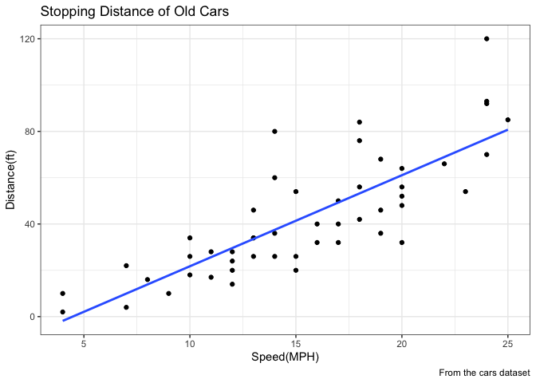
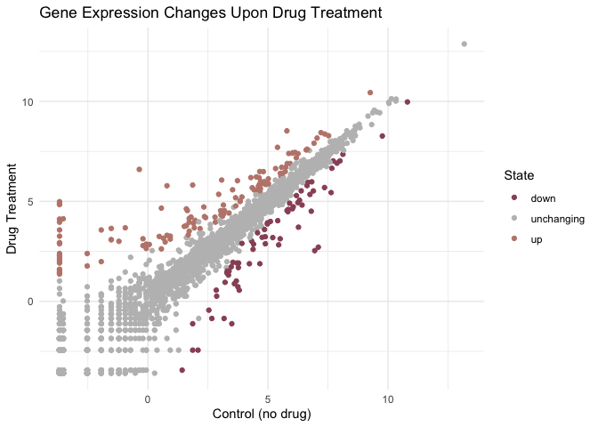
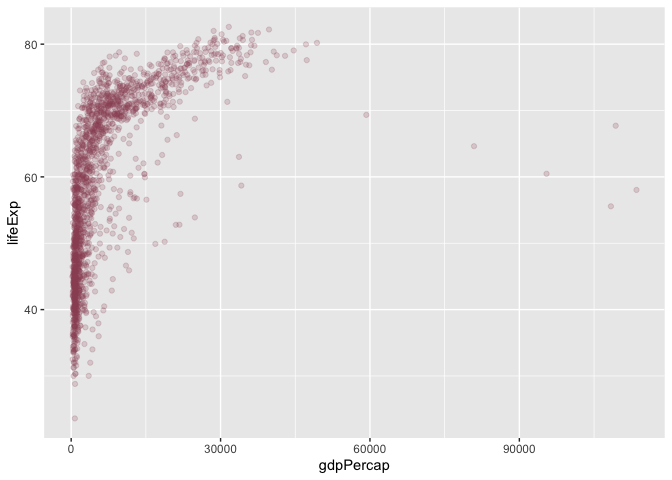
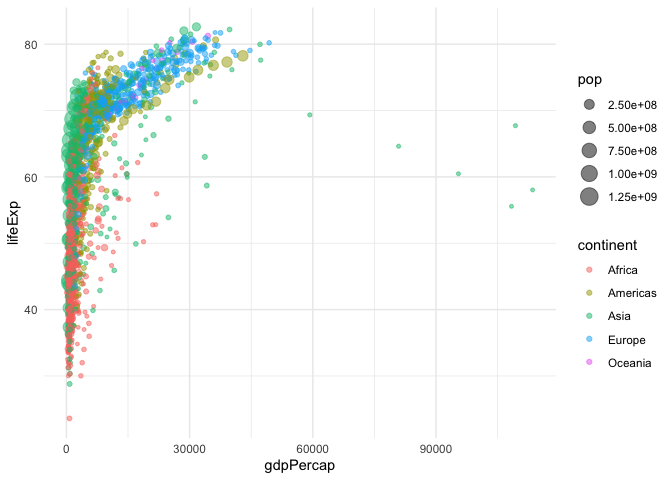
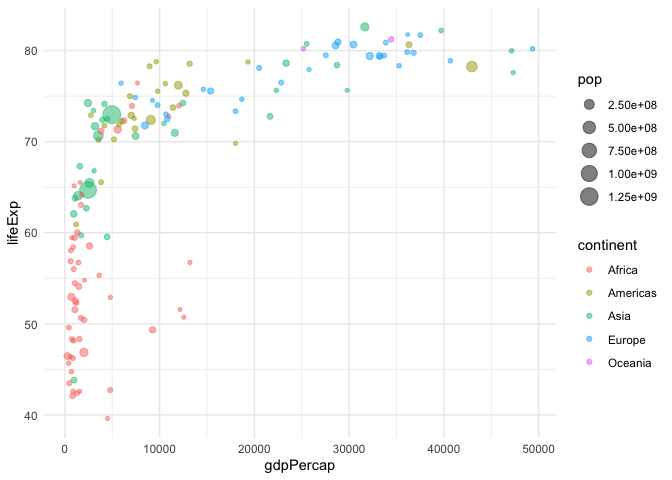
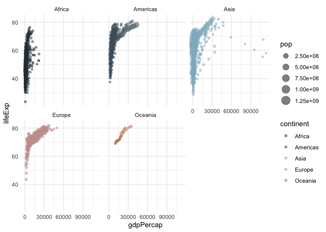

# Class 5: Data Visualization with ggplot
Lilith Sadil (A16470107)

## Introduction

There are many plotting systems in R, including *“base”*
plotting/graphics

``` r
plot(cars)
```


Base plot is generally rather short code & the plots it makes are fairly
dull; however, it’s fast for plotting large data sets.

Using **ggplot2** makes more robust graphs but takes more work.

``` r
#ggplot(cars)
```

To use ggplot2, we first have to install the package to the computer
through the function `install.packages("ggplot2")` in the R
console/“brain”.

Every time we want to use a package like ggplot2, we have to load it
into the R “brain” using a `library()` call.

``` r
library(ggplot2)
```

Now that ggplot2 is loaded, we can make plots

``` r
ggplot(cars)
```


To make a graph in ggplot, at least 3 elements are always needed:

    1.  data (the data.frame with the data you want to plot - ex."cars" data set)
    2. aes (The aesthetic mapping of the data in the plot - colors, thickness...) 
    3. geom (How the plot should look - columns, lines, points...)

``` r
ggplot(cars) +
  aes(x=speed,y=dist)+
  geom_point()
```


Graphs can be defined as variables in order to use them without
copy/pasting their contents each time.

``` r
dp=ggplot(cars) +
  aes(x=speed,y=dist)+
  geom_point()
```

Here, additional features are added onto the starting “dp” graph defined
above.

``` r
dp+geom_smooth(se=FALSE, method="lm")+
  labs(title="Stopping Distance of Old Cars",
       x="Speed(MPH)",
       y="Distance(ft)",
       caption="From the cars dataset")+
  theme_bw()
```

    `geom_smooth()` using formula = 'y ~ x'



## A more complicated scatter plot

Here, we make a plot of gene expression data. To look at the first few
(6) lines of the “genes” database, we use the `head` command:

``` r
url="https://bioboot.github.io/bimm143_S20/class-material/up_down_expression.txt"
genes=read.delim(url)
head(genes)
```

            Gene Condition1 Condition2      State
    1      A4GNT -3.6808610 -3.4401355 unchanging
    2       AAAS  4.5479580  4.3864126 unchanging
    3      AASDH  3.7190695  3.4787276 unchanging
    4       AATF  5.0784720  5.0151916 unchanging
    5       AATK  0.4711421  0.5598642 unchanging
    6 AB015752.4 -3.6808610 -3.5921390 unchanging

Using `nrow()` tells us how many data points are in the “genes” data set
Using `colnames()` tells us the names of the columns in the “genes” data
set Using `ncol()` tells us how many columns are in the “genes” data set

``` r
nrow(genes)
```

    [1] 5196

``` r
colnames(genes)
```

    [1] "Gene"       "Condition1" "Condition2" "State"     

``` r
ncol(genes)
```

    [1] 4

Using the `table()` function on a column (\$) within “genes” allows us
to see the number of genes that are up/down regulated and unchanging

``` r
table(genes$State)
```


          down unchanging         up 
            72       4997        127 

Alternatively, we can use logicals to count up the number of
“up”regulated genes:

``` r
sum(genes$State == "up")
```

    [1] 127

Next, we’ll use this data to make a scatter plot:

``` r
y= ggplot(genes)+
  aes(x=Condition1, y=Condition2)+
  geom_point()
```

``` r
y+aes(col=State)
```


We can also use a `scale_color_manual()` command to customize the colors
of the different data points based on their value in the “State” column
(up/down/unchanging)

``` r
y+aes(col=State) +
  scale_color_manual(values=c("#985265", "grey", "#BF867B")) +
  theme_minimal() +
  labs(title="Gene Expression Changes Upon Drug Treatment",
       x="Control (no drug)",
       y="Drug Treatment")
```



## Going Further

Additional packages can be installed into ggplot2 in order to form more
complex graphs - for instance, we can install the package
`install.packages("dplyr")`

In this section, we’ll use a data set on socioeconomic data of many
countries spanning back to 1952:

``` r
url = "https://raw.githubusercontent.com/jennybc/gapminder/master/inst/extdata/gapminder.tsv"
gapminder = read.delim(url)
```

``` r
library(dplyr)
```


    Attaching package: 'dplyr'

    The following objects are masked from 'package:stats':

        filter, lag

    The following objects are masked from 'package:base':

        intersect, setdiff, setequal, union

``` r
head(gapminder)
```

          country continent year lifeExp      pop gdpPercap
    1 Afghanistan      Asia 1952  28.801  8425333  779.4453
    2 Afghanistan      Asia 1957  30.332  9240934  820.8530
    3 Afghanistan      Asia 1962  31.997 10267083  853.1007
    4 Afghanistan      Asia 1967  34.020 11537966  836.1971
    5 Afghanistan      Asia 1972  36.088 13079460  739.9811
    6 Afghanistan      Asia 1977  38.438 14880372  786.1134

``` r
table(gapminder$year)
```


    1952 1957 1962 1967 1972 1977 1982 1987 1992 1997 2002 2007 
     142  142  142  142  142  142  142  142  142  142  142  142 

To figure out what/how many `unique` continents are in the dataset:

``` r
unique(gapminder$continent)
```

    [1] "Asia"     "Europe"   "Africa"   "Americas" "Oceania" 

``` r
length(unique(gapminder$continent))
```

    [1] 5

``` r
length(unique(gapminder$country))
```

    [1] 142

Here, we’ll make a scatter plot to show the relationship between gdp per
capita and life expectancy of people:

*Note: the parameter “alpha” can be used in `geom_point` to alter the
opacity of the dots* *Note: here, we define the data’s color under
`geom_point` rather than under an `aes` since we’re not referencing the
data for categories when we’re coloring the data - all of it is one
color*

``` r
ggplot(gapminder) +
  aes(x=gdpPercap, y=lifeExp)+
  geom_point(alpha=0.2, col="#985265")
```



Here, we’re separating the data points by color depending on continent.
Additionally, `aes(size=pop)` makes it so that the size of each point
correlates to the population size of the country.

``` r
ggplot(gapminder) +
  aes(x=gdpPercap, y=lifeExp)+
  geom_point(alpha=0.5) +
  aes(col=continent) +
  aes(size=pop) +
  theme_minimal()
```



Now we’ll make a plot with data from only the year 2007

``` r
gapminder_2007 = gapminder %>% filter(year==2007)
ggplot(gapminder_2007)+
  aes(x=gdpPercap, y=lifeExp, size=pop)+
  geom_point(alpha=0.5)+
  aes(col=continent)+
  theme_minimal()
```



Finally, we’ll make a plot to compare the data by years. In order to do
so, we use a `facet_wrap` command and sort by the category of
**“continent”**:

``` r
ggplot(gapminder)+
  aes(x=gdpPercap, y=lifeExp, size=pop)+
  geom_point(alpha=0.5)+
  aes(col=continent)+
  scale_color_manual(values=c("#2B3D41", "#4C5F6B", "#91B7C7", "#C89F9C", "#C97C5D")) +
  theme_minimal() +
  facet_wrap(~continent)
```


