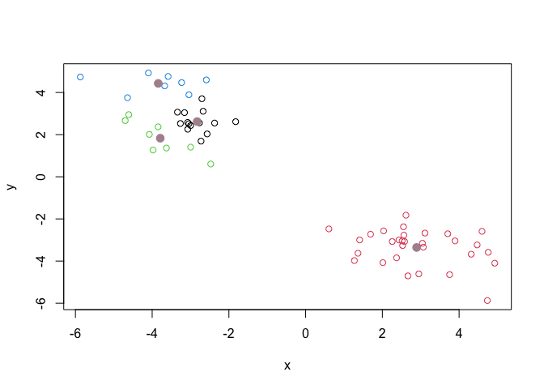

# Class 7: Machine Learning 1
Lilith Sadil, A16470107

Today, we’ll start out multi-part exploration of some key machine
learning methods. We’ll begin with clustering (a way of
bunching/grouping data based off of similarity/patterns and then using
dimensional reduction).

## Clustering

Let’s start with “k-means” clustering. In this approach, you define how
many groups (# = k) you want and then the computer bunches the data you
provide into k groups

The main function in base R for this is `kmeans()`.

``` r
#Make up some data; here, 1000 points will be randomly generated along a normal distribution and assigned to the variable "numbers"
numbers1 = rnorm(1000)
# we can turn this data into a histogram:
hist(numbers1)
```


``` r
#we can also make a histogram with a shifted mean - at 3 instead of 0 
numbers2 = rnorm(1000, mean=3)
hist(numbers2)
```


Next, we’ll make two data sets of 30 points - one is centered around -3
and the other around +3

``` r
rnorm(30,-3)
```

     [1] -2.8015876 -3.0611732 -2.6342345 -2.6637867 -4.6457000 -2.6758354
     [7] -1.5382004 -0.9907593 -4.4408958 -4.5005591 -2.5093445 -3.1657619
    [13] -2.6394572 -4.4693518 -3.0248762 -0.7356480 -2.8559178 -2.3672273
    [19] -3.7541460 -3.6024740 -2.6300835 -3.2584356 -1.9944156 -1.7844740
    [25] -4.5281881 -2.4041255 -3.2487358 -3.8168173 -3.4652621 -2.8900836

``` r
rnorm(30,3)
```

     [1] 3.5131475 3.1325086 3.1812069 2.4346782 1.8935681 3.7602009 2.5818704
     [8] 2.8743115 1.6038818 3.8459731 1.6614341 5.4330022 3.0686991 3.4761657
    [15] 1.8112216 2.9566344 3.3016993 2.2857391 3.9152673 2.9337534 0.9576512
    [22] 2.4121839 2.3967005 1.9377702 1.1886113 2.7474903 3.7651952 2.5209147
    [29] 4.0238873 1.9043270

Next, we’ll concatenate these two data sets/vectors into one data set

``` r
combined_data = c(rnorm(30,-3), rnorm(30,3))
```

If we want to print the values centered around +3 first, we can reverse
the order of the vector

``` r
combined_data = c(rnorm(30,-3), rnorm(30,3))
xy_data = cbind(x=combined_data, y=rev(combined_data))
plot(xy_data)
```


Now, we’ll use kmeans to analyse these groups

``` r
km = kmeans(xy_data, centers=2)
#in the parentheses of kmeans, we input x (numeric data matrix we're analysing) and centers (the number of clusters we want,k)
km
```

    K-means clustering with 2 clusters of sizes 30, 30

    Cluster means:
              x         y
    1 -3.354306  2.893226
    2  2.893226 -3.354306

    Clustering vector:
     [1] 1 1 1 1 1 1 1 1 1 1 1 1 1 1 1 1 1 1 1 1 1 1 1 1 1 1 1 1 1 1 2 2 2 2 2 2 2 2
    [39] 2 2 2 2 2 2 2 2 2 2 2 2 2 2 2 2 2 2 2 2 2 2

    Within cluster sum of squares by cluster:
    [1] 58.8306 58.8306
     (between_SS / total_SS =  90.9 %)

    Available components:

    [1] "cluster"      "centers"      "totss"        "withinss"     "tot.withinss"
    [6] "betweenss"    "size"         "iter"         "ifault"      

``` r
#the center of each cluster group is located at (3.11,-2.97) and (-2.97, 3.11)
```

When we use the k-means operation, we are able to access 9 different
pieces of information/components regarding the data set - one is “size”
which tells us the size of each cluster

> Q. How many points in each cluster?

``` r
km$size
```

    [1] 30 30

> Q. What component of your result object details cluster
> allignment/membership?

``` r
km$cluster
```

     [1] 1 1 1 1 1 1 1 1 1 1 1 1 1 1 1 1 1 1 1 1 1 1 1 1 1 1 1 1 1 1 2 2 2 2 2 2 2 2
    [39] 2 2 2 2 2 2 2 2 2 2 2 2 2 2 2 2 2 2 2 2 2 2

> Q. What are centers/mean values of each cluster?

``` r
km$centers
```

              x         y
    1 -3.354306  2.893226
    2  2.893226 -3.354306

> Q. Make a plot of the data showing clustering results.

Here, we want to separate out our data clusters based on color. How do
we do this? By default, if only 2 color values are assigned, then those
colors will be “recycled” to alternate the color of every point.

``` r
plot(xy_data, col=c("#AF929D", "#615055"))
```


To assign color by clusters, we have to split the data clusters into
their respective vectors and color them (items=1 are black, items=2 are
red). Next, we’ll mark the cluster centers with a pink dot

``` r
plot(xy_data, col=km$cluster)
points(km$centers, col="#AF929D", pch=20, cex=2)
```


> Q. Run `kmeans()` again and cluster into four groups then plot.

``` r
kmeans(xy_data, centers=4)
```

    K-means clustering with 4 clusters of sizes 30, 14, 8, 8

    Cluster means:
              x         y
    1 -3.354306  2.893226
    2  2.620818 -2.827395
    3  1.831338 -3.788561
    4  4.431827 -3.842145

    Clustering vector:
     [1] 1 1 1 1 1 1 1 1 1 1 1 1 1 1 1 1 1 1 1 1 1 1 1 1 1 1 1 1 1 1 2 2 3 2 4 4 4 3
    [39] 2 3 2 2 2 3 2 2 4 4 2 3 4 2 4 3 3 2 2 3 4 2

    Within cluster sum of squares by cluster:
    [1] 58.830599  5.291138  8.493045  8.748943
     (between_SS / total_SS =  93.7 %)

    Available components:

    [1] "cluster"      "centers"      "totss"        "withinss"     "tot.withinss"
    [6] "betweenss"    "size"         "iter"         "ifault"      

``` r
km4 = kmeans(xy_data, centers=4)
plot(xy_data, col=km4$cluster)
points(km4$centers, col="#AF929D", pch=20, cex=2)
```



Here, the clusters aren’t as distinct as before - however, 4 clusters
were formed since we told the computer it had to.

## Hierarchical Clustering

This form of clustering aims to reveal the structure in your data by
progressively grouping points into an ever smaller number of clusters.

The main function in base R for this is called `hclust()`. This function
doesn’t take our input data directly; it requires a “distance matrix”
that details how dis/similar all out input points are to each other.

We can use the `dist()` function on our xy_data dataset in order to get
the distance between every pair of points in the dataset

``` r
dist(xy_data)
```

                 1           2           3           4           5           6
    2   1.70543291                                                            
    3   0.85961757  2.55672935                                                
    4   0.85253862  2.38881891  0.78215839                                    
    5   1.09715512  2.05848575  1.48351261  0.75738515                        
    6   1.72588045  3.39552050  1.02890150  1.05241117  1.72680857            
    7   1.41917139  2.86300347  0.90626992  1.68109837  2.33231697  1.68685036
    8   1.29171566  1.12179107  1.95134360  2.14332181  2.19248481  2.94998104
    9   0.54425080  2.17685458  0.60225510  0.33168473  0.89149679  1.21871844
    10  2.01138998  1.54614764  2.57154279  2.86266635  2.93960311  3.59570060
    11  1.27429627  2.60751701  0.95877332  1.68666995  2.27228965  1.86380985
    12  1.50572298  2.90843200  1.30898696  0.66275992  0.92793930  0.96000996
    13  1.40764146  0.65654273  2.18695183  2.21825316  2.10379495  3.13032701
    14  1.71031585  1.00839269  2.40311148  2.55377395  2.51961372  3.39494188
    15  0.90139689  0.90027003  1.75556712  1.49263982  1.20076250  2.51564482
    16  1.58315621  2.12509547  2.03660060  1.29802907  0.55309153  2.19557672
    17  1.69421932  3.21571324  1.28337943  0.85337023  1.30201871  0.63287274
    18  0.67076761  1.49016697  1.38709032  0.94095116  0.63397372  1.98986127
    19  0.62575820  2.13083858  0.81432003  0.25937049  0.67219110  1.29069432
    20  0.72033321  2.20226459  0.85013370  0.19046542  0.63562677  1.24082473
    21  1.28346210  2.98048648  0.42432073  1.03210378  1.78408625  0.78679415
    22  0.55575711  2.07636453  0.79812197  0.32089675  0.70263173  1.33407152
    23  2.60867079  3.99270693  2.23487344  1.75632302  1.94654838  1.38171143
    24  3.03287678  3.28715359  3.11528190  3.74026685  4.12657080  4.04976101
    25  0.87908214  0.83734771  1.72154022  1.63607122  1.50109305  2.59568079
    26  1.47163147  2.22090552  1.59543795  2.16878235  2.56877814  2.59415672
    27  0.18528462  1.65334866  0.96347492  0.79146443  0.92690909  1.74468263
    28  1.90505539  3.60442425  1.10758257  1.33937754  2.05186669  0.36095570
    29  1.29092189  2.56423280  1.32201077  0.55199026  0.55236653  1.25421450
    30  0.76362876  2.04447364  1.09330305  0.42829962  0.39610173  1.47288059
    31  8.29966540  8.98781673  8.21325513  7.54928200  7.25498248  7.44307092
    32  7.78612468  8.52623958  7.67755558  7.02432789  6.75304915  6.89353216
    33  8.41946206  9.40334373  8.15333796  7.59832089  7.47572749  7.24894477
    34  8.91679957  9.58467414  8.83349425  8.16872710  7.86905877  8.06113686
    35 10.47648368 11.20702434 10.34042599  9.70516520  9.44795756  9.51733129
    36  9.46904950 10.01961973  9.44457976  8.75267133  8.39941195  8.71855219
    37 12.04804827 12.77823874 11.89971599 11.27249502 11.02217638 11.06152561
    38  6.80287523  7.75966161  6.57952517  5.99302231  5.84106368  5.71600745
    39  8.53005796  9.25032262  8.42181737  7.76944586  7.49409375  7.63185846
    40  8.92542329  9.81729788  8.71015878  8.12116779  7.94511405  7.83708730
    41  8.37373612  9.10538775  8.26108027  7.61085591  7.34031023  7.46874408
    42  8.46426358  9.18971673  8.35392949  7.70258494  7.42946512  7.56277381
    43  8.63334755  9.23622194  8.59052109  7.90593876  7.57122075  7.85472741
    44  7.70202375  8.58203014  7.51083022  6.90507255  6.71327233  6.66294754
    45  7.70623388  8.26483155  7.70255236  6.99952616  6.63386714  7.01064417
    46  9.10700230  9.63923792  9.09699017  8.39843647  8.03373015  8.38640099
    47 10.48103997 10.99714286 10.46469122  9.77016447  9.40763357  9.73951232
    48 10.03490460 10.54251589 10.02763630  9.32883685  8.95956096  9.31309244
    49  7.67394687  8.48302485  7.52630745  6.89446532  6.66074981  6.71189936
    50  9.92473463 10.74465722  9.74184887  9.13345047  8.92167771  8.88670410
    51 10.94303693 11.49586011 10.90242909 10.21907975  9.87624795 10.15391892
    52  8.63262599  9.37999581  8.50721981  7.86422184  7.60425954  7.70276317
    53 10.20048910 10.77407925 10.15542677  9.47351551  9.13617059  9.40703540
    54  9.82047667 10.68170972  9.61405186  9.02022198  8.83126505  8.74281021
    55  8.18376872  9.12695965  7.94629004  7.37118954  7.22159173  7.06216405
    56  8.01841656  8.65997551  7.96294777  7.28343931  6.96238702  7.22159173
    57  8.30808104  9.07210158  8.17742068  7.53690591  7.28343931  7.37118954
    58  8.96673799  9.79186634  8.79119867  8.17742068  7.96294777  7.94629004
    59  9.74687810 10.16286685  9.79186634  9.07210158  8.65997551  9.12695965
    60  9.06172763  9.74687810  8.96673799  8.30808104  8.01841656  8.18376872
                 7           8           9          10          11          12
    2                                                                         
    3                                                                         
    4                                                                         
    5                                                                         
    6                                                                         
    7                                                                         
    8   1.94277091                                                            
    9   1.44484386  1.83322813                                                
    10  2.34283183  0.74739784  2.54283587                                    
    11  0.29833190  1.65469149  1.41024119  2.04501371                        
    12  2.20310555  2.78861286  0.99388426  3.51660996  2.26481240            
    13  2.32680172  0.46807675  1.94255506  0.98030026  2.05126757  2.82386970
    14  2.37350768  0.45409547  2.25456638  0.54213579  2.08039304  3.18517732
    15  2.25212476  1.14637605  1.30314526  1.85669062  2.04992531  2.01242351
    16  2.87920114  2.51292880  1.44314415  3.24589954  2.80626004  1.29071825
    17  2.11913045  2.98474740  1.15154259  3.69036788  2.23113338  0.39297244
    18  2.07869410  1.56786183  0.83033601  2.31320160  1.94489001  1.41836914
    19  1.66493243  1.90606754  0.22024608  2.63438601  1.62462217  0.88284545
    20  1.72045240  1.99924928  0.28269031  2.72850122  1.69276896  0.78937319
    21  0.90572324  2.33566896  0.95973257  2.91649268  1.07856478  1.38588777
    22  1.62972737  1.83650489  0.19586703  2.56438790  1.57904679  0.95266949
    23  3.03453553  3.89778409  2.07771211  4.61877554  3.17070429  1.11477957
    24  2.37804031  2.23866439  3.41792162  1.78481108  2.18783557  4.37807680
    25  2.06435743  0.75919141  1.38358869  1.47960095  1.82950462  2.22409398
    26  1.08826552  1.11965348  1.84419938  1.29676375  0.80370018  2.81414701
    27  1.59111822  1.37133469  0.52777894  2.10736359  1.45598409  1.41943372
    28  1.57219301  3.05857777  1.44504333  3.66077971  1.79384813  1.32002836
    29  2.22682204  2.53582414  0.85452251  3.27655116  2.23865751  0.37622186
    30  1.93634068  1.97377870  0.49635075  2.71678981  1.88156394  0.86970293
    31  9.07150735  9.43686220  7.87311155 10.17945060  9.17169447  6.91762194
    32  8.52973641  8.94084623  7.35005899  9.68554431  8.63524546  6.38713284
    33  8.93392322  9.65467659  7.92998629 10.40055931  9.08662975  6.93687533
    34  9.69141900 10.04840943  8.49224768 10.79006735  9.79193134  7.53768494
    35 11.17623288 11.63610153 10.03273020 12.38075840 11.29505856  9.06138544
    36 10.31893439 10.55486589  9.06998582 11.28894234 10.40272959  8.13883834
    37 12.72786065 13.21075037 11.60076451 13.95551968 12.85241096 10.62622544
    38  7.38927040  8.02552920  6.32443852  8.77234437  7.52485614  5.33497498
    39  9.27216693  9.68027336  8.09510540 10.42431447  9.37929285  7.13214514
    40  9.51495761 10.13539016  8.45233127 10.88276533  9.65421971  7.46434732
    41  9.11026154  9.52761721  7.93686798 10.27208421  9.21835061  6.97252633
    42  9.20370409  9.61617502  8.02841228 10.36041458  9.31130670  7.06479259
    43  9.46120753  9.73794614  8.22537537 10.47570312  9.54910543  7.28675850
    44  8.33103104  8.90460346  7.23557467  9.65199706  8.46030632  6.25140129
    45  8.58477354  8.78821770  7.31422040  9.52273027  8.65909262  6.39431534
    46  9.97553793 10.18372123  8.71397211 10.91631131 10.05438198  7.78967579
    47 11.33992251 11.55523980 10.08649947 12.28657363 11.42265695  9.15842681
    48 10.90569648 11.10410815  9.64403568 11.83468684 10.98507393  8.72038110
    49  8.36458114  8.85287496  7.22290048  9.59949925  8.48118475  6.24850593
    50 10.55896690 11.11415059  9.46352227 11.86112862 10.69073475  8.48118475
    51 11.77041388 12.03410274 10.53824056 12.76846673 11.86112862  9.59949925
    52  9.35112272  9.79317395  8.19115577 10.53824056  9.46352227  7.22290048
    53 11.02304414 11.29822619  9.79317395 12.03410274 11.11415059  8.85287496
    54 10.42049799 11.02304414  9.35112272 11.77041388 10.55896690  8.36458114
    55  8.74281021  9.40703540  7.70276317 10.15391892  8.88670410  6.71189936
    56  8.83126505  9.13617059  7.60425954  9.87624795  8.92167771  6.66074981
    57  9.02022198  9.47351551  7.86422184 10.21907975  9.13345047  6.89446532
    58  9.61405186 10.15542677  8.50721981 10.90242909  9.74184887  7.52630745
    59 10.68170972 10.77407925  9.37999581 11.49586011 10.74465722  8.48302485
    60  9.82047667 10.20048910  8.63262599 10.94303693  9.92473463  7.67394687
                13          14          15          16          17          18
    2                                                                         
    3                                                                         
    4                                                                         
    5                                                                         
    6                                                                         
    7                                                                         
    8                                                                         
    9                                                                         
    10                                                                        
    11                                                                        
    12                                                                        
    13                                                                        
    14  0.45505445                                                            
    15  0.93071557  1.37408585                                                
    16  2.32995209  2.77480612  1.40080582                                    
    17  3.07156007  3.40292301  2.31544361  1.68366494                        
    18  1.47199496  1.88569175  0.59586753  0.98163947  1.73269974            
    19  1.96354326  2.30792575  1.23647881  1.22462713  1.10904820  0.70103079
    20  2.05035818  2.39902741  1.30460411  1.18803805  1.02568906  0.75068522
    21  2.59683854  2.78961344  2.17661445  2.32968268  1.23568837  1.78023695
    22  1.89808287  2.23957586  1.18534563  1.25188246  1.17358328  0.66672046
    23  3.93773562  4.29914086  3.10668881  2.11118355  0.95713992  2.51096405
    24  2.65346246  2.28910330  3.33280957  4.57137232  4.39857996  3.59103271
    25  0.60715869  1.02133831  0.38797493  1.76674996  2.48636032  0.86754733
    26  1.58196993  1.46113063  1.93955630  3.04022679  2.86478147  2.07364299
    27  1.42755259  1.76736622  0.80035642  1.40090282  1.64474491  0.48973942
    28  3.28457028  3.51065461  2.74642645  2.53847809  0.98943064  2.25494123
    29  2.52624521  2.90983802  1.67682532  0.94415182  0.75903775  1.08129763
    30  1.96496132  2.34507255  1.14548878  0.94680759  1.17554226  0.55723247
    31  9.27212735  9.71796445  8.34396998  6.94317310  6.95243744  7.86972242
    32  8.78975757  9.23250425  7.85978558  6.45988806  6.41147018  7.37298712
    33  9.57316740  9.99528547  8.64923171  7.28233914  6.87141125  8.10959854
    34  9.87836365 10.32535668  8.95127354  7.55073201  7.57239277  8.48191277
    35 11.48249291 11.92627218 10.55301284  9.15256889  9.06485463 10.06824269
    36 10.35526884 10.80706131  9.43671209  8.04326654  8.20307670  8.99722437
    37 13.05708173 13.50105078 12.12771260 10.72719572 10.62133313 11.64290250
    38  7.93479756  8.35967334  7.00930117  5.63915383  5.29650015  6.47446280
    39  9.52392447  9.96801719  8.59458839  7.19404175  7.15443360  8.11247453
    40 10.02664653 10.45807784  9.09742386  7.71153466  7.42696526  8.57647075
    41  9.37428399  9.81767022  8.44459006  7.04433236  6.99283313  7.95975843
    42  9.46119882  9.90497353  8.53169383  7.13126480  7.08611889  8.04833925
    43  9.55148415 10.00131438  8.62837767  7.23055470  7.34388363  8.17556692
    44  8.79199353  9.22431746  7.86250535  6.47589913  6.22958370  7.34388363
    45  8.59121209  9.04246374  7.67130284  6.27691091  6.47589913  7.23055470
    46  9.97978906 10.43207742  9.06283856  7.67130284  7.86250535  8.62837767
    47 11.34697505 11.79984909 10.43207742  9.04246374  9.22431746 10.00131438
    48 10.89393324 11.34697505  9.97978906  8.59121209  8.79199353  9.55148415
    49  8.72038110  9.15842681  7.78967579  6.39431534  6.25140129  7.28675850
    50 10.98507393 11.42265695 10.05438198  8.65909262  8.46030632  9.54910543
    51 11.83468684 12.28657363 10.91631131  9.52273027  9.65199706 10.47570312
    52  9.64403568 10.08649947  8.71397211  7.31422040  7.23557467  8.22537537
    53 11.10410815 11.55523980 10.18372123  8.78821770  8.90460346  9.73794614
    54 10.90569648 11.33992251  9.97553793  8.58477354  8.33103104  9.46120753
    55  9.31309244  9.73951232  8.38640099  7.01064417  6.66294754  7.85472741
    56  8.95956096  9.40763357  8.03373015  6.63386714  6.71327233  7.57122075
    57  9.32883685  9.77016447  8.39843647  6.99952616  6.90507255  7.90593876
    58 10.02763630 10.46469122  9.09699017  7.70255236  7.51083022  8.59052109
    59 10.54251589 10.99714286  9.63923792  8.26483155  8.58203014  9.23622194
    60 10.03490460 10.48103997  9.10700230  7.70623388  7.70202375  8.63334755
                19          20          21          22          23          24
    2                                                                         
    3                                                                         
    4                                                                         
    5                                                                         
    6                                                                         
    7                                                                         
    8                                                                         
    9                                                                         
    10                                                                        
    11                                                                        
    12                                                                        
    13                                                                        
    14                                                                        
    15                                                                        
    16                                                                        
    17                                                                        
    18                                                                        
    19                                                                        
    20  0.09459160                                                            
    21  1.14605456  1.15562422                                                
    22  0.07006302  0.16458286  1.14814918                                    
    23  1.99278088  1.90066491  2.13102111  2.06193425                        
    24  3.59608238  3.68370060  3.26307203  3.53315751  5.34866105            
    25  1.37789252  1.46094904  2.14465177  1.31533380  3.33616079  2.95311463
    26  2.02131904  2.10882858  1.82982993  1.95871933  3.82152212  1.57487323
    27  0.54080098  0.63168784  1.38023719  0.47312352  2.53221202  3.19967346
    28  1.55556208  1.52002516  0.74869105  1.58871678  1.64372611  3.94964072
    29  0.67841035  0.58765580  1.50711058  0.74513835  1.42996432  4.26997543
    30  0.27901193  0.26193049  1.41557435  0.30661616  1.97664728  3.79042354
    31  7.70349259  7.61319827  8.17897983  7.76909222  6.06140816 11.28952447
    32  7.18458269  7.09348276  7.63450191  7.25088978  5.51239458 10.76326364
    33  7.79618595  7.70184594  8.02877711  7.86564283  5.91894259 11.26758515
    34  8.32189606  8.23176820  8.79845535  8.38734562  6.67959523 11.90899372
    35  9.87136592  9.77963568 10.27465689  9.93821480  8.14400083 13.43941860
    36  8.88986542  8.80213674  9.43675997  8.95327540  7.33899628 12.48581897
    37 11.44131082 11.34931179 11.82446928 11.50839723  9.69355134 15.00344427
    38  6.18249458  6.08856603  6.48419181  6.25147171  4.35611726  9.69355134
    39  7.92927166  7.83825572  8.37583240  7.99549774  6.25147171 11.50839723
    40  8.30715764  8.21350906  8.60938544  8.37583240  6.48419181 11.82446928
    41  7.77189055  7.68071823  8.21350906  7.83825572  6.08856603 11.34931179
    42  7.86298017  7.77189055  8.30715764  7.92927166  6.18249458 11.44131082
    43  8.04833925  7.95975843  8.57647075  8.11247453  6.47446280 11.64290250
    44  7.08611889  6.99283313  7.42696526  7.15443360  5.29650015 10.62133313
    45  7.13126480  7.04433236  7.71153466  7.19404175  5.63915383 10.72719572
    46  8.53169383  8.44459006  9.09742386  8.59458839  7.00930117 12.12771260
    47  9.90497353  9.81767022 10.45807784  9.96801719  8.35967334 13.50105078
    48  9.46119882  9.37428399 10.02664653  9.52392447  7.93479756 13.05708173
    49  7.06479259  6.97252633  7.46434732  7.13214514  5.33497498 10.62622544
    50  9.31130670  9.21835061  9.65421971  9.37929285  7.52485614 12.85241096
    51 10.36041458 10.27208421 10.88276533 10.42431447  8.77234437 13.95551968
    52  8.02841228  7.93686798  8.45233127  8.09510540  6.32443852 11.60076451
    53  9.61617502  9.52761721 10.13539016  9.68027336  8.02552920 13.21075037
    54  9.20370409  9.11026154  9.51495761  9.27216693  7.38927040 12.72786065
    55  7.56277381  7.46874408  7.83708730  7.63185846  5.71600745 11.06152561
    56  7.42946512  7.34031023  7.94511405  7.49409375  5.84106368 11.02217638
    57  7.70258494  7.61085591  8.12116779  7.76944586  5.99302231 11.27249502
    58  8.35392949  8.26108027  8.71015878  8.42181737  6.57952517 11.89971599
    59  9.18971673  9.10538775  9.81729788  9.25032262  7.75966161 12.77823874
    60  8.46426358  8.37373612  8.92542329  8.53005796  6.80287523 12.04804827
                25          26          27          28          29          30
    2                                                                         
    3                                                                         
    4                                                                         
    5                                                                         
    6                                                                         
    7                                                                         
    8                                                                         
    9                                                                         
    10                                                                        
    11                                                                        
    12                                                                        
    13                                                                        
    14                                                                        
    15                                                                        
    16                                                                        
    17                                                                        
    18                                                                        
    19                                                                        
    20                                                                        
    21                                                                        
    22                                                                        
    23                                                                        
    24                                                                        
    25                                                                        
    26  1.60641670                                                            
    27  0.85662605  1.64599485                                                
    28  2.78412815  2.56935023  1.95412058                                    
    29  1.92017506  2.69525561  1.17074814  1.60271473                        
    30  1.36063780  2.22090400  0.62023912  1.76738654  0.56478737            
    31  8.70563692  9.71721032  8.15415140  7.68553323  7.02554584  7.53733943
    32  8.21637543  9.19310160  7.64411437  7.13154920  6.50618300  7.02554584
    33  8.97545892  9.73275166  8.30146990  7.42221661  7.13154920  7.68553323
    34  9.31483659 10.33640905  8.77040091  8.30146990  7.64411437  8.15415140
    35 10.91094839 11.87312349 10.33640905  9.73275166  9.19310160  9.71721032
    36  9.80940022 10.91094839  9.31483659  8.97545892  8.21637543  8.70563692
    37 12.48581897 13.43941860 11.90899372 11.26758515 10.76326364 11.28952447
    38  7.33899628  8.14400083  6.67959523  5.91894259  5.51239458  6.06140816
    39  8.95327540  9.93821480  8.38734562  7.86564283  7.25088978  7.76909222
    40  9.43675997 10.27465689  8.79845535  8.02877711  7.63450191  8.17897983
    41  8.80213674  9.77963568  8.23176820  7.70184594  7.09348276  7.61319827
    42  8.88986542  9.87136592  8.32189606  7.79618595  7.18458269  7.70349259
    43  8.99722437 10.06824269  8.48191277  8.10959854  7.37298712  7.86972242
    44  8.20307670  9.06485463  7.57239277  6.87141125  6.41147018  6.95243744
    45  8.04326654  9.15256889  7.55073201  7.28233914  6.45988806  6.94317310
    46  9.43671209 10.55301284  8.95127354  8.64923171  7.85978558  8.34396998
    47 10.80706131 11.92627218 10.32535668  9.99528547  9.23250425  9.71796445
    48 10.35526884 11.48249291  9.87836365  9.57316740  8.78975757  9.27212735
    49  8.13883834  9.06138544  7.53768494  6.93687533  6.38713284  6.91762194
    50 10.40272959 11.29505856  9.79193134  9.08662975  8.63524546  9.17169447
    51 11.28894234 12.38075840 10.79006735 10.40055931  9.68554431 10.17945060
    52  9.06998582 10.03273020  8.49224768  7.92998629  7.35005899  7.87311155
    53 10.55486589 11.63610153 10.04840943  9.65467659  8.94084623  9.43686220
    54 10.31893439 11.17623288  9.69141900  8.93392322  8.52973641  9.07150735
    55  8.71855219  9.51733129  8.06113686  7.24894477  6.89353216  7.44307092
    56  8.39941195  9.44795756  7.86905877  7.47572749  6.75304915  7.25498248
    57  8.75267133  9.70516520  8.16872710  7.59832089  7.02432789  7.54928200
    58  9.44457976 10.34042599  8.83349425  8.15333796  7.67755558  8.21325513
    59 10.01961973 11.20702434  9.58467414  9.40334373  8.52623958  8.98781673
    60  9.46904950 10.47648368  8.91679957  8.41946206  7.78612468  8.29966540
                31          32          33          34          35          36
    2                                                                         
    3                                                                         
    4                                                                         
    5                                                                         
    6                                                                         
    7                                                                         
    8                                                                         
    9                                                                         
    10                                                                        
    11                                                                        
    12                                                                        
    13                                                                        
    14                                                                        
    15                                                                        
    16                                                                        
    17                                                                        
    18                                                                        
    19                                                                        
    20                                                                        
    21                                                                        
    22                                                                        
    23                                                                        
    24                                                                        
    25                                                                        
    26                                                                        
    27                                                                        
    28                                                                        
    29                                                                        
    30                                                                        
    31                                                                        
    32  0.56478737                                                            
    33  1.76738654  1.60271473                                                
    34  0.62023912  1.17074814  1.95412058                                    
    35  2.22090400  2.69525561  2.56935023  1.64599485                        
    36  1.36063780  1.92017506  2.78412815  0.85662605  1.60641670            
    37  3.79042354  4.26997543  3.94964072  3.19967346  1.57487323  2.95311463
    38  1.97664728  1.42996432  1.64372611  2.53221202  3.82152212  3.33616079
    39  0.30661616  0.74513835  1.58871678  0.47312352  1.95871933  1.31533380
    40  1.41557435  1.50711058  0.74869105  1.38023719  1.82982993  2.14465177
    41  0.26193049  0.58765580  1.52002516  0.63168784  2.10882858  1.46094904
    42  0.27901193  0.67841035  1.55556208  0.54080098  2.02131904  1.37789252
    43  0.55723247  1.08129763  2.25494123  0.48973942  2.07364299  0.86754733
    44  1.17554226  0.75903775  0.98943064  1.64474491  2.86478147  2.48636032
    45  0.94680759  0.94415182  2.53847809  1.40090282  3.04022679  1.76674996
    46  1.14548878  1.67682532  2.74642645  0.80035642  1.93955630  0.38797493
    47  2.34507255  2.90983802  3.51065461  1.76736622  1.46113063  1.02133831
    48  1.96496132  2.52624521  3.28457028  1.42755259  1.58196993  0.60715869
    49  0.86970293  0.37622186  1.32002836  1.41943372  2.81414701  2.22409398
    50  1.88156394  2.23865751  1.79384813  1.45598409  0.80370018  1.82950462
    51  2.71678981  3.27655116  3.66077971  2.10736359  1.29676375  1.47960095
    52  0.49635075  0.85452251  1.44504333  0.52777894  1.84419938  1.38358869
    53  1.97377870  2.53582414  3.05857777  1.37133469  1.11965348  0.75919141
    54  1.93634068  2.22682204  1.57219301  1.59111822  1.08826552  2.06435743
    55  1.47288059  1.25421450  0.36095570  1.74468263  2.59415672  2.59568079
    56  0.39610173  0.55236653  2.05186669  0.92690909  2.56877814  1.50109305
    57  0.42829962  0.55199026  1.33937754  0.79146443  2.16878235  1.63607122
    58  1.09330305  1.32201077  1.10758257  0.96347492  1.59543795  1.72154022
    59  2.04447364  2.56423280  3.60442425  1.65334866  2.22090552  0.83734771
    60  0.76362876  1.29092189  1.90505539  0.18528462  1.47163147  0.87908214
                37          38          39          40          41          42
    2                                                                         
    3                                                                         
    4                                                                         
    5                                                                         
    6                                                                         
    7                                                                         
    8                                                                         
    9                                                                         
    10                                                                        
    11                                                                        
    12                                                                        
    13                                                                        
    14                                                                        
    15                                                                        
    16                                                                        
    17                                                                        
    18                                                                        
    19                                                                        
    20                                                                        
    21                                                                        
    22                                                                        
    23                                                                        
    24                                                                        
    25                                                                        
    26                                                                        
    27                                                                        
    28                                                                        
    29                                                                        
    30                                                                        
    31                                                                        
    32                                                                        
    33                                                                        
    34                                                                        
    35                                                                        
    36                                                                        
    37                                                                        
    38  5.34866105                                                            
    39  3.53315751  2.06193425                                                
    40  3.26307203  2.13102111  1.14814918                                    
    41  3.68370060  1.90066491  0.16458286  1.15562422                        
    42  3.59608238  1.99278088  0.07006302  1.14605456  0.09459160            
    43  3.59103271  2.51096405  0.66672046  1.78023695  0.75068522  0.70103079
    44  4.39857996  0.95713992  1.17358328  1.23568837  1.02568906  1.10904820
    45  4.57137232  2.11118355  1.25188246  2.32968268  1.18803805  1.22462713
    46  3.33280957  3.10668881  1.18534563  2.17661445  1.30460411  1.23647881
    47  2.28910330  4.29914086  2.23957586  2.78961344  2.39902741  2.30792575
    48  2.65346246  3.93773562  1.89808287  2.59683854  2.05035818  1.96354326
    49  4.37807680  1.11477957  0.95266949  1.38588777  0.78937319  0.88284545
    50  2.18783557  3.17070429  1.57904679  1.07856478  1.69276896  1.62462217
    51  1.78481108  4.61877554  2.56438790  2.91649268  2.72850122  2.63438601
    52  3.41792162  2.07771211  0.19586703  0.95973257  0.28269031  0.22024608
    53  2.23866439  3.89778409  1.83650489  2.33566896  1.99924928  1.90606754
    54  2.37804031  3.03453553  1.62972737  0.90572324  1.72045240  1.66493243
    55  4.04976101  1.38171143  1.33407152  0.78679415  1.24082473  1.29069432
    56  4.12657080  1.94654838  0.70263173  1.78408625  0.63562677  0.67219110
    57  3.74026685  1.75632302  0.32089675  1.03210378  0.19046542  0.25937049
    58  3.11528190  2.23487344  0.79812197  0.42432073  0.85013370  0.81432003
    59  3.28715359  3.99270693  2.07636453  2.98048648  2.20226459  2.13083858
    60  3.03287678  2.60867079  0.55575711  1.28346210  0.72033321  0.62575820
                43          44          45          46          47          48
    2                                                                         
    3                                                                         
    4                                                                         
    5                                                                         
    6                                                                         
    7                                                                         
    8                                                                         
    9                                                                         
    10                                                                        
    11                                                                        
    12                                                                        
    13                                                                        
    14                                                                        
    15                                                                        
    16                                                                        
    17                                                                        
    18                                                                        
    19                                                                        
    20                                                                        
    21                                                                        
    22                                                                        
    23                                                                        
    24                                                                        
    25                                                                        
    26                                                                        
    27                                                                        
    28                                                                        
    29                                                                        
    30                                                                        
    31                                                                        
    32                                                                        
    33                                                                        
    34                                                                        
    35                                                                        
    36                                                                        
    37                                                                        
    38                                                                        
    39                                                                        
    40                                                                        
    41                                                                        
    42                                                                        
    43                                                                        
    44  1.73269974                                                            
    45  0.98163947  1.68366494                                                
    46  0.59586753  2.31544361  1.40080582                                    
    47  1.88569175  3.40292301  2.77480612  1.37408585                        
    48  1.47199496  3.07156007  2.32995209  0.93071557  0.45505445            
    49  1.41836914  0.39297244  1.29071825  2.01242351  3.18517732  2.82386970
    50  1.94489001  2.23113338  2.80626004  2.04992531  2.08039304  2.05126757
    51  2.31320160  3.69036788  3.24589954  1.85669062  0.54213579  0.98030026
    52  0.83033601  1.15154259  1.44314415  1.30314526  2.25456638  1.94255506
    53  1.56786183  2.98474740  2.51292880  1.14637605  0.45409547  0.46807675
    54  2.07869410  2.11913045  2.87920114  2.25212476  2.37350768  2.32680172
    55  1.98986127  0.63287274  2.19557672  2.51564482  3.39494188  3.13032701
    56  0.63397372  1.30201871  0.55309153  1.20076250  2.51961372  2.10379495
    57  0.94095116  0.85337023  1.29802907  1.49263982  2.55377395  2.21825316
    58  1.38709032  1.28337943  2.03660060  1.75556712  2.40311148  2.18695183
    59  1.49016697  3.21571324  2.12509547  0.90027003  1.00839269  0.65654273
    60  0.67076761  1.69421932  1.58315621  0.90139689  1.71031585  1.40764146
                49          50          51          52          53          54
    2                                                                         
    3                                                                         
    4                                                                         
    5                                                                         
    6                                                                         
    7                                                                         
    8                                                                         
    9                                                                         
    10                                                                        
    11                                                                        
    12                                                                        
    13                                                                        
    14                                                                        
    15                                                                        
    16                                                                        
    17                                                                        
    18                                                                        
    19                                                                        
    20                                                                        
    21                                                                        
    22                                                                        
    23                                                                        
    24                                                                        
    25                                                                        
    26                                                                        
    27                                                                        
    28                                                                        
    29                                                                        
    30                                                                        
    31                                                                        
    32                                                                        
    33                                                                        
    34                                                                        
    35                                                                        
    36                                                                        
    37                                                                        
    38                                                                        
    39                                                                        
    40                                                                        
    41                                                                        
    42                                                                        
    43                                                                        
    44                                                                        
    45                                                                        
    46                                                                        
    47                                                                        
    48                                                                        
    49                                                                        
    50  2.26481240                                                            
    51  3.51660996  2.04501371                                                
    52  0.99388426  1.41024119  2.54283587                                    
    53  2.78861286  1.65469149  0.74739784  1.83322813                        
    54  2.20310555  0.29833190  2.34283183  1.44484386  1.94277091            
    55  0.96000996  1.86380985  3.59570060  1.21871844  2.94998104  1.68685036
    56  0.92793930  2.27228965  2.93960311  0.89149679  2.19248481  2.33231697
    57  0.66275992  1.68666995  2.86266635  0.33168473  2.14332181  1.68109837
    58  1.30898696  0.95877332  2.57154279  0.60225510  1.95134360  0.90626992
    59  2.90843200  2.60751701  1.54614764  2.17685458  1.12179107  2.86300347
    60  1.50572298  1.27429627  2.01138998  0.54425080  1.29171566  1.41917139
                55          56          57          58          59
    2                                                             
    3                                                             
    4                                                             
    5                                                             
    6                                                             
    7                                                             
    8                                                             
    9                                                             
    10                                                            
    11                                                            
    12                                                            
    13                                                            
    14                                                            
    15                                                            
    16                                                            
    17                                                            
    18                                                            
    19                                                            
    20                                                            
    21                                                            
    22                                                            
    23                                                            
    24                                                            
    25                                                            
    26                                                            
    27                                                            
    28                                                            
    29                                                            
    30                                                            
    31                                                            
    32                                                            
    33                                                            
    34                                                            
    35                                                            
    36                                                            
    37                                                            
    38                                                            
    39                                                            
    40                                                            
    41                                                            
    42                                                            
    43                                                            
    44                                                            
    45                                                            
    46                                                            
    47                                                            
    48                                                            
    49                                                            
    50                                                            
    51                                                            
    52                                                            
    53                                                            
    54                                                            
    55                                                            
    56  1.72680857                                                
    57  1.05241117  0.75738515                                    
    58  1.02890150  1.48351261  0.78215839                        
    59  3.39552050  2.05848575  2.38881891  2.55672935            
    60  1.72588045  1.09715512  0.85253862  0.85961757  1.70543291

Now, we’ll assign the resulting distance matrix to a variable, hc, and
apply heirarchical clustering

``` r
hc = hclust(dist(xy_data))
hc
```


    Call:
    hclust(d = dist(xy_data))

    Cluster method   : complete 
    Distance         : euclidean 
    Number of objects: 60 

The resulting information isn’t very useful on its own; let’s plot it:

``` r
plot(hc)
```


The vertical height of the dendrogram shows the similarity of two
clusters through the vertical height that separates the crossbar between
them. The two major clusters on the left and right sides are split by
the first and last 30 data points; the 1st 30 make up the 1st cluster &
points 30-60 create the second cluster.

The biggest “goalpost” indicates the optimal separation of clusters (ex.
the top-most crossbar separates two clusters with a very larger vertical
distance; the left and right groups are good clusterings).

We can create an upper limit or cutoff line, we can insert an `abline()`
at our desired y-value/height.

``` r
plot(hc)
abline(h=10,col="red")
```


Now, we can cut the tree at a y-value of 10. Everything clustered under
that line gets assigned to a cluster (cluster1 assigned a value of 1,
cluster2 assigned a value of 2).

``` r
grps = cutree(hc, h=10)
grps
```

     [1] 1 1 1 1 1 1 1 1 1 1 1 1 1 1 1 1 1 1 1 1 1 1 1 1 1 1 1 1 1 1 2 2 2 2 2 2 2 2
    [39] 2 2 2 2 2 2 2 2 2 2 2 2 2 2 2 2 2 2 2 2 2 2

Now, we can plot the original data (xy_data) with the colors split based
off of the clustering we did above (grps).

``` r
plot(xy_data, col=grps)
```


``` r
# alternatively, we can use: plot(xy_data, col=cutree(hc, h=10))
```

## Principal Component Analysis

The goal of PCA is to reduce the dimensionality of a dataset down to
some smaller subset of new variables (called PCs) which are useful bases
for further analysis - like visualization, clustering, etc.

In this part of the module, we’ll look at a way of reading the food
consumption of individuals across 4 countries in the UK, across 17
different categories (potato, cheese, fruit…).

First, we’ll import the dataset:

``` r
url <- "https://tinyurl.com/UK-foods"
x <- read.csv(url, row.names=1) # saying row.names=1 means that we start counting the columns at england not at the cheese/carcass_meat... column - we get 4 columns instead of 5 
x
```

                        England Wales Scotland N.Ireland
    Cheese                  105   103      103        66
    Carcass_meat            245   227      242       267
    Other_meat              685   803      750       586
    Fish                    147   160      122        93
    Fats_and_oils           193   235      184       209
    Sugars                  156   175      147       139
    Fresh_potatoes          720   874      566      1033
    Fresh_Veg               253   265      171       143
    Other_Veg               488   570      418       355
    Processed_potatoes      198   203      220       187
    Processed_Veg           360   365      337       334
    Fresh_fruit            1102  1137      957       674
    Cereals                1472  1582     1462      1494
    Beverages                57    73       53        47
    Soft_drinks            1374  1256     1572      1506
    Alcoholic_drinks        375   475      458       135
    Confectionery            54    64       62        41

To look at the first few lines of the datset:

``` r
head(x)
```

                   England Wales Scotland N.Ireland
    Cheese             105   103      103        66
    Carcass_meat       245   227      242       267
    Other_meat         685   803      750       586
    Fish               147   160      122        93
    Fats_and_oils      193   235      184       209
    Sugars             156   175      147       139

> Q1. How many rows and columns are in your new data frame named x? What
> R functions could you use to answer this questions?

``` r
dim(x) # or separately,
```

    [1] 17  4

``` r
ncol(x)
```

    [1] 4

``` r
nrow(x)
```

    [1] 17

We can make a barplot which compares the consumption of each of the 17
food categories across the 4 countries; not very readable without PCA
since there are too many dimensions to work with.

``` r
barplot(as.matrix(x), col=rainbow(nrow(x)))
```


``` r
#using rainbow(nrow(x)) gives us one color of the rainbow for each of the 17 rows in x
```

We can also plot each of these relationships pairwise (ex. england is
the y-axis for the top, rightmost graph and n.ireland is the x-axis);
below and above the diagnoal are the same. For each graph, we can draw a
diagonal line across the plot; any departure from the straight line
means that the two countries being compared differ for that data point
(ex. the scotland v. north ireland plot shows that food consumption
associated with the green dot is different). Pairs plots may be useful
for small datasets but are less readable for large datasets.

``` r
pairs(x, col=rainbow(nrow(x)), pch=16)
```


PCA will help make this data comparison more readable:

The main function to do this in base R is `prcomp()`

``` r
t(x) #this transposes the matrix so that the food act as columns and the countries are the rows (inverts the data)
```

              Cheese Carcass_meat  Other_meat  Fish Fats_and_oils  Sugars
    England      105           245         685  147            193    156
    Wales        103           227         803  160            235    175
    Scotland     103           242         750  122            184    147
    N.Ireland     66           267         586   93            209    139
              Fresh_potatoes  Fresh_Veg  Other_Veg  Processed_potatoes 
    England               720        253        488                 198
    Wales                 874        265        570                 203
    Scotland              566        171        418                 220
    N.Ireland            1033        143        355                 187
              Processed_Veg  Fresh_fruit  Cereals  Beverages Soft_drinks 
    England              360         1102     1472        57         1374
    Wales                365         1137     1582        73         1256
    Scotland             337          957     1462        53         1572
    N.Ireland            334          674     1494        47         1506
              Alcoholic_drinks  Confectionery 
    England                 375             54
    Wales                   475             64
    Scotland                458             62
    N.Ireland               135             41

``` r
pca = prcomp(t(x)) #apple PCA to the transposed food/country matrix
summary(pca) #gives a summary of the pca analysis 
```

    Importance of components:
                                PC1      PC2      PC3       PC4
    Standard deviation     324.1502 212.7478 73.87622 3.176e-14
    Proportion of Variance   0.6744   0.2905  0.03503 0.000e+00
    Cumulative Proportion    0.6744   0.9650  1.00000 1.000e+00

Note how PC1 always has the most variable (largest standard deviation);
proportion of variance tells us that PC1 (a 1 dimensional line across
the data) captures the broadest/largest amount of the variance in the
data (67.44%). PC2 adds a second dimension and captures an additional
29.05% of variance in the data. Adding a third dimension, PC3, captures
an additional 3.5% of variance in the data. Together, all 3 dimensions
cover ~100% of the data’s variance. PCA1 is the most important since it
captures the greatest amount of variance in the data/

``` r
pca$x
```

                     PC1         PC2        PC3           PC4
    England   -144.99315   -2.532999 105.768945 -4.894696e-14
    Wales     -240.52915 -224.646925 -56.475555  5.700024e-13
    Scotland   -91.86934  286.081786 -44.415495 -7.460785e-13
    N.Ireland  477.39164  -58.901862  -4.877895  2.321303e-13

A major PCA result vizualization is called a “PCA plot” (a.k.a. a score
plot/biplot/PC1 v PC2 plot/ordination plot - depending on the field of
data analysis you’re working in).

Now, we’ll plot PCA1 vs PCA2. By doing so, we see that there’s a large
outliar in the data set (n.ireland, dark green

``` r
mycols = c("orange", "red", "blue", "darkgreen")
plot(pca$x[,1], pca$x[,2], col=mycols, pch=16, cex=2)
```


We can also plot this using the names of each country

``` r
plot(pca$x[,1], pca$x[,2], xlab="PC1", ylab="PC2", xlim=c(-270,500))
text(pca$x[,1], pca$x[,2], colnames(x))
```


Now, we see that ireland is very different from the other countries. But
how? What categories of food consumption set it aside from the rest of
the UK?

------------------------------------------------------------------------

Another important output from PCA is called the “loadings” vector or the
“rotation” component - it tells us how much the original variables
(here, the food categories) contribute to the new PCs.

``` r
pca$rotation
```

                                 PC1          PC2         PC3          PC4
    Cheese              -0.056955380  0.016012850  0.02394295 -0.694538519
    Carcass_meat         0.047927628  0.013915823  0.06367111  0.489884628
    Other_meat          -0.258916658 -0.015331138 -0.55384854  0.279023718
    Fish                -0.084414983 -0.050754947  0.03906481 -0.008483145
    Fats_and_oils       -0.005193623 -0.095388656 -0.12522257  0.076097502
    Sugars              -0.037620983 -0.043021699 -0.03605745  0.034101334
    Fresh_potatoes       0.401402060 -0.715017078 -0.20668248 -0.090972715
    Fresh_Veg           -0.151849942 -0.144900268  0.21382237 -0.039901917
    Other_Veg           -0.243593729 -0.225450923 -0.05332841  0.016719075
    Processed_potatoes  -0.026886233  0.042850761 -0.07364902  0.030125166
    Processed_Veg       -0.036488269 -0.045451802  0.05289191 -0.013969507
    Fresh_fruit         -0.632640898 -0.177740743  0.40012865  0.184072217
    Cereals             -0.047702858 -0.212599678 -0.35884921  0.191926714
    Beverages           -0.026187756 -0.030560542 -0.04135860  0.004831876
    Soft_drinks          0.232244140  0.555124311 -0.16942648  0.103508492
    Alcoholic_drinks    -0.463968168  0.113536523 -0.49858320 -0.316290619
    Confectionery       -0.029650201  0.005949921 -0.05232164  0.001847469

Some values are positive and negative; positive values for a certain
category means that that food is consumed more than the other countries;
negative values say the opposite (i.e that country eats less of a
particular food). Ireland, for example, had a positive 0.40 value for
fresh potatoes

Here, we’ve added in axes which shows PCA1 vs PCA2 ::: {.cell}

``` r
mycols = c("orange", "red", "blue", "darkgreen")
plot(pca$x[,1], pca$x[,2], col=mycols, pch=16, cex=2)
abline(h=0, col="grey")
abline(v=0, col="grey")
```

<div class="cell-output-display">


</div>

:::

We’ll leave it off here for this class, but the main takewaway for this
section is that PCS is a useful method for gaining some insight into
data with many dimensions which are difficult to examine in other ways.

# PCA Of RNASeq Data

## Data Input

``` r
url2 = "https://tinyurl.com/expression-CSV"
rna.data = read.csv(url2, row.names=1)
head(rna.data)
```

           wt1 wt2  wt3  wt4 wt5 ko1 ko2 ko3 ko4 ko5
    gene1  439 458  408  429 420  90  88  86  90  93
    gene2  219 200  204  210 187 427 423 434 433 426
    gene3 1006 989 1030 1017 973 252 237 238 226 210
    gene4  783 792  829  856 760 849 856 835 885 894
    gene5  181 249  204  244 225 277 305 272 270 279
    gene6  460 502  491  491 493 612 594 577 618 638

wt stands for “wild type” and ko stands for “knockout”

``` r
pca = prcomp(t(rna.data), scale=TRUE) #scale=true makes sure that the data is scaled
summary(pca)
```

    Importance of components:
                              PC1    PC2     PC3     PC4     PC5     PC6     PC7
    Standard deviation     9.6237 1.5198 1.05787 1.05203 0.88062 0.82545 0.80111
    Proportion of Variance 0.9262 0.0231 0.01119 0.01107 0.00775 0.00681 0.00642
    Cumulative Proportion  0.9262 0.9493 0.96045 0.97152 0.97928 0.98609 0.99251
                               PC8     PC9      PC10
    Standard deviation     0.62065 0.60342 3.457e-15
    Proportion of Variance 0.00385 0.00364 0.000e+00
    Cumulative Proportion  0.99636 1.00000 1.000e+00

92.3% of variance in the original data set is captured by PC1 alone.

> Q. How many genes are in the dataset?

``` r
nrow(rna.data)
```

    [1] 100

``` r
attributes(pca)
```

    $names
    [1] "sdev"     "rotation" "center"   "scale"    "x"       

    $class
    [1] "prcomp"

pca\$x tells us the coordinates of the calculated PC1,2,3… for each
variable or column in the dataset; using this, we can plot the points to
see how similar or different each gene is to one-another ::: {.cell}

``` r
head(pca$x)
```

<div class="cell-output cell-output-stdout">

              PC1        PC2        PC3        PC4        PC5        PC6
    wt1 -9.697374  1.5233313 -0.2753567  0.7322391 -0.6749398  1.1823860
    wt2 -9.138950  0.3748504  1.0867958 -1.9461655  0.7571209 -0.4369228
    wt3 -9.054263 -0.9855163  0.4152966  1.4166028  0.5835918  0.6937236
    wt4 -8.731483 -0.7468371  0.5875748  0.2268129 -1.5404775 -1.2723618
    wt5 -9.006312 -0.2945307 -1.8498101 -0.4303812  0.8666124 -0.2496025
    ko1  8.846999  2.2345475 -0.1462750 -1.1544333 -0.6947862  0.7128021
                PC7         PC8         PC9         PC10
    wt1 -0.24446614  1.03519396  0.07010231 3.073930e-15
    wt2 -0.03275370  0.26622249  0.72780448 1.963707e-15
    wt3 -0.03578383 -1.05851494  0.52979799 2.893519e-15
    wt4 -0.52795595 -0.20995085 -0.50325679 2.872702e-15
    wt5  0.83227047 -0.05891489 -0.81258430 1.693090e-15
    ko1 -0.07864392 -0.94652648 -0.24613776 4.052314e-15

</div>

:::

Now, we’ll make a plot of the pca\$x data in ggplot2

``` r
library(ggplot2)
```

``` r
res = as.data.frame(pca$x)
head(res)
```

              PC1        PC2        PC3        PC4        PC5        PC6
    wt1 -9.697374  1.5233313 -0.2753567  0.7322391 -0.6749398  1.1823860
    wt2 -9.138950  0.3748504  1.0867958 -1.9461655  0.7571209 -0.4369228
    wt3 -9.054263 -0.9855163  0.4152966  1.4166028  0.5835918  0.6937236
    wt4 -8.731483 -0.7468371  0.5875748  0.2268129 -1.5404775 -1.2723618
    wt5 -9.006312 -0.2945307 -1.8498101 -0.4303812  0.8666124 -0.2496025
    ko1  8.846999  2.2345475 -0.1462750 -1.1544333 -0.6947862  0.7128021
                PC7         PC8         PC9         PC10
    wt1 -0.24446614  1.03519396  0.07010231 3.073930e-15
    wt2 -0.03275370  0.26622249  0.72780448 1.963707e-15
    wt3 -0.03578383 -1.05851494  0.52979799 2.893519e-15
    wt4 -0.52795595 -0.20995085 -0.50325679 2.872702e-15
    wt5  0.83227047 -0.05891489 -0.81258430 1.693090e-15
    ko1 -0.07864392 -0.94652648 -0.24613776 4.052314e-15

Now, we’ll plot PC1 vs PC2. Note that separation of points on the PC1
axis is far more significant than PC2 since PC1 accounts for 96% of the
data’s variance (PC2 is onlt ~2% of the variance).

``` r
ggplot(res)+
  aes(x=PC1,y=PC2)+
  geom_point()
```


We can also use `kmeans` on the first column of pca\$x (i.e. PCA1) to
determine the two categories which we can sort the genes into (the dots
on the left and right halves of the plot above). ::: {.cell}

``` r
kmeans(pca$x[,1], centers=2)
```

<div class="cell-output cell-output-stdout">

    K-means clustering with 2 clusters of sizes 5, 5

    Cluster means:
           [,1]
    1 -9.125676
    2  9.125676

    Clustering vector:
    wt1 wt2 wt3 wt4 wt5 ko1 ko2 ko3 ko4 ko5 
      1   1   1   1   1   2   2   2   2   2 

    Within cluster sum of squares by cluster:
    [1] 0.5017505 0.2648467
     (between_SS / total_SS =  99.9 %)

    Available components:

    [1] "cluster"      "centers"      "totss"        "withinss"     "tot.withinss"
    [6] "betweenss"    "size"         "iter"         "ifault"      

</div>

:::
