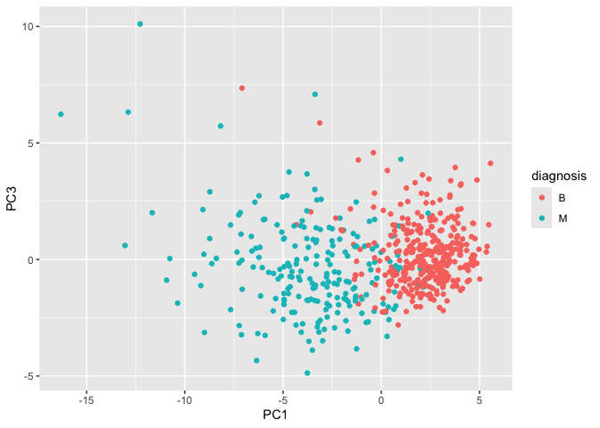
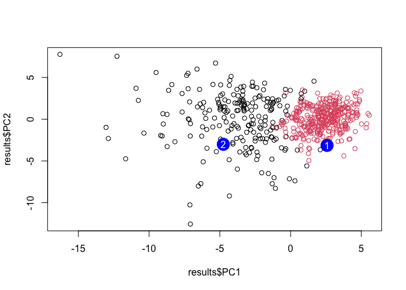

# Class08_Breast Cancer Mini Project
Lilith Sadil, A16470107

## About

In today’s lab, we’ll work with fine needle aspiration (FNA) of breast
mass data from the University of Wisconsin.

## Data Import

Here, we’ll import the FNA data as “fna.data” then save it as a data set
“wisc.df” then look at the first few rows of the dataset:

``` r
fna.data="WisconsinCancer.csv"
wisc.df = read.csv(fna.data, row.names=1)
head(wisc.df)
```

             diagnosis radius_mean texture_mean perimeter_mean area_mean
    842302           M       17.99        10.38         122.80    1001.0
    842517           M       20.57        17.77         132.90    1326.0
    84300903         M       19.69        21.25         130.00    1203.0
    84348301         M       11.42        20.38          77.58     386.1
    84358402         M       20.29        14.34         135.10    1297.0
    843786           M       12.45        15.70          82.57     477.1
             smoothness_mean compactness_mean concavity_mean concave.points_mean
    842302           0.11840          0.27760         0.3001             0.14710
    842517           0.08474          0.07864         0.0869             0.07017
    84300903         0.10960          0.15990         0.1974             0.12790
    84348301         0.14250          0.28390         0.2414             0.10520
    84358402         0.10030          0.13280         0.1980             0.10430
    843786           0.12780          0.17000         0.1578             0.08089
             symmetry_mean fractal_dimension_mean radius_se texture_se perimeter_se
    842302          0.2419                0.07871    1.0950     0.9053        8.589
    842517          0.1812                0.05667    0.5435     0.7339        3.398
    84300903        0.2069                0.05999    0.7456     0.7869        4.585
    84348301        0.2597                0.09744    0.4956     1.1560        3.445
    84358402        0.1809                0.05883    0.7572     0.7813        5.438
    843786          0.2087                0.07613    0.3345     0.8902        2.217
             area_se smoothness_se compactness_se concavity_se concave.points_se
    842302    153.40      0.006399        0.04904      0.05373           0.01587
    842517     74.08      0.005225        0.01308      0.01860           0.01340
    84300903   94.03      0.006150        0.04006      0.03832           0.02058
    84348301   27.23      0.009110        0.07458      0.05661           0.01867
    84358402   94.44      0.011490        0.02461      0.05688           0.01885
    843786     27.19      0.007510        0.03345      0.03672           0.01137
             symmetry_se fractal_dimension_se radius_worst texture_worst
    842302       0.03003             0.006193        25.38         17.33
    842517       0.01389             0.003532        24.99         23.41
    84300903     0.02250             0.004571        23.57         25.53
    84348301     0.05963             0.009208        14.91         26.50
    84358402     0.01756             0.005115        22.54         16.67
    843786       0.02165             0.005082        15.47         23.75
             perimeter_worst area_worst smoothness_worst compactness_worst
    842302            184.60     2019.0           0.1622            0.6656
    842517            158.80     1956.0           0.1238            0.1866
    84300903          152.50     1709.0           0.1444            0.4245
    84348301           98.87      567.7           0.2098            0.8663
    84358402          152.20     1575.0           0.1374            0.2050
    843786            103.40      741.6           0.1791            0.5249
             concavity_worst concave.points_worst symmetry_worst
    842302            0.7119               0.2654         0.4601
    842517            0.2416               0.1860         0.2750
    84300903          0.4504               0.2430         0.3613
    84348301          0.6869               0.2575         0.6638
    84358402          0.4000               0.1625         0.2364
    843786            0.5355               0.1741         0.3985
             fractal_dimension_worst
    842302                   0.11890
    842517                   0.08902
    84300903                 0.08758
    84348301                 0.17300
    84358402                 0.07678
    843786                   0.12440

> Q1. How many observations/patients/individual samples are in this
> dataset?

``` r
nrow(wisc.df)
```

    [1] 569

There are 569 patient observations.

> Q2. How many of the observations have a malignant diagnosis?

``` r
#wisc.df[,1] or wisc.df$diagnosis will give you all the values in column 1. To see the number of "B" vs "M" diagnoses, we can use a "table" function:
table(wisc.df[,1]) 
```


      B   M 
    357 212 

``` r
# we can also use sum(wisc.df$diagnosis=="M")
```

There are 212 malignant cases of the 569 patients.

> Q3. How many variables/features in the data are suffixed with
> “\_mean”?

``` r
colnames(wisc.df) # prints out all the column names in the data set
```

     [1] "diagnosis"               "radius_mean"            
     [3] "texture_mean"            "perimeter_mean"         
     [5] "area_mean"               "smoothness_mean"        
     [7] "compactness_mean"        "concavity_mean"         
     [9] "concave.points_mean"     "symmetry_mean"          
    [11] "fractal_dimension_mean"  "radius_se"              
    [13] "texture_se"              "perimeter_se"           
    [15] "area_se"                 "smoothness_se"          
    [17] "compactness_se"          "concavity_se"           
    [19] "concave.points_se"       "symmetry_se"            
    [21] "fractal_dimension_se"    "radius_worst"           
    [23] "texture_worst"           "perimeter_worst"        
    [25] "area_worst"              "smoothness_worst"       
    [27] "compactness_worst"       "concavity_worst"        
    [29] "concave.points_worst"    "symmetry_worst"         
    [31] "fractal_dimension_worst"

``` r
#the grep function helps find patterns among data points
grep("_mean", colnames(wisc.df))
```

     [1]  2  3  4  5  6  7  8  9 10 11

``` r
length(grep("_mean", colnames(wisc.df)))
```

    [1] 10

``` r
#using additional inputs like ignore.case=FALSE will make the code not case-sensitive
```

From this, we know that columns 2, 3, 4, 5, 6, 7, 8, 9, 10, and 11 all
have “\_mean” in the name. By applying the `length` feature, we can
count the number of columns with “\_mean” in the name. Here, that value
is 10.

## Initial Analysis

Before analyzing the data, we want to remove the expert diagnosis column
(i.e. the answer) from our dataset) and reassign it to its own variable:

``` r
diagnosis = as.factor(wisc.df$diagnosis)
head(diagnosis)
```

    [1] M M M M M M
    Levels: B M

``` r
# We can use -1 here to remove the first column ("diagnosis")
wisc.data = wisc.df[,-1]
```

## Clustering

Now, we can try a `kmeans()` clustering first:

``` r
km=kmeans(wisc.data, centers=2)
head(km$cluster)
```

      842302   842517 84300903 84348301 84358402   843786 
           1        1        1        2        1        2 

``` r
table(km$cluster)
```


      1   2 
    131 438 

Applying the table function to our clustering of the data tells us that
there are 131 patients with a “1” diagnosis and 438 patients with a “2”
diagnosis

To make a cross table to compare our clustering to the row of
professional diagnoses:

``` r
table(km$cluster, diagnosis)
```

       diagnosis
          B   M
      1   1 130
      2 356  82

This chart gives us an idea of the true/false positive diagnoses

Next, let’s try using `hclust()` to group the data:

``` r
distance = dist(wisc.data)
hc = hclust(distance)
hc
```


    Call:
    hclust(d = distance)

    Cluster method   : complete 
    Distance         : euclidean 
    Number of objects: 569 

Now, we can plot the hc data into a dendrogram & draw a line to separate
the two groups (malignant & benign). In this case, though, it’s not easy
to determine where the two groups should be split:

``` r
plot(hc)
abline(h=3500, col="red")
```


This tree is hard to read and doesn’t account for the fact that out
variables use different units of measurement; we have to scale the data
first so that the smaller units with much larger values don’t dominate.

## PCA

Since the dendrogram we obtained through `hclust` is not very readable,
we will have to re-scale the data first

We can look at the standard deviation of each

``` r
round(apply(wisc.data, 2, sd))
```

                radius_mean            texture_mean          perimeter_mean 
                          4                       4                      24 
                  area_mean         smoothness_mean        compactness_mean 
                        352                       0                       0 
             concavity_mean     concave.points_mean           symmetry_mean 
                          0                       0                       0 
     fractal_dimension_mean               radius_se              texture_se 
                          0                       0                       1 
               perimeter_se                 area_se           smoothness_se 
                          2                      45                       0 
             compactness_se            concavity_se       concave.points_se 
                          0                       0                       0 
                symmetry_se    fractal_dimension_se            radius_worst 
                          0                       0                       5 
              texture_worst         perimeter_worst              area_worst 
                          6                      34                     569 
           smoothness_worst       compactness_worst         concavity_worst 
                          0                       0                       0 
       concave.points_worst          symmetry_worst fractal_dimension_worst 
                          0                       0                       0 

The standard deviations are very large for some categories (like
area_worst) so scaling is appropriate here. We can try using scale=TRUE
in prcomp()

``` r
wisc.pr = prcomp(wisc.data, scale=TRUE)
summary(wisc.pr)
```

    Importance of components:
                              PC1    PC2     PC3     PC4     PC5     PC6     PC7
    Standard deviation     3.6444 2.3857 1.67867 1.40735 1.28403 1.09880 0.82172
    Proportion of Variance 0.4427 0.1897 0.09393 0.06602 0.05496 0.04025 0.02251
    Cumulative Proportion  0.4427 0.6324 0.72636 0.79239 0.84734 0.88759 0.91010
                               PC8    PC9    PC10   PC11    PC12    PC13    PC14
    Standard deviation     0.69037 0.6457 0.59219 0.5421 0.51104 0.49128 0.39624
    Proportion of Variance 0.01589 0.0139 0.01169 0.0098 0.00871 0.00805 0.00523
    Cumulative Proportion  0.92598 0.9399 0.95157 0.9614 0.97007 0.97812 0.98335
                              PC15    PC16    PC17    PC18    PC19    PC20   PC21
    Standard deviation     0.30681 0.28260 0.24372 0.22939 0.22244 0.17652 0.1731
    Proportion of Variance 0.00314 0.00266 0.00198 0.00175 0.00165 0.00104 0.0010
    Cumulative Proportion  0.98649 0.98915 0.99113 0.99288 0.99453 0.99557 0.9966
                              PC22    PC23   PC24    PC25    PC26    PC27    PC28
    Standard deviation     0.16565 0.15602 0.1344 0.12442 0.09043 0.08307 0.03987
    Proportion of Variance 0.00091 0.00081 0.0006 0.00052 0.00027 0.00023 0.00005
    Cumulative Proportion  0.99749 0.99830 0.9989 0.99942 0.99969 0.99992 0.99997
                              PC29    PC30
    Standard deviation     0.02736 0.01153
    Proportion of Variance 0.00002 0.00000
    Cumulative Proportion  1.00000 1.00000

Now, PC1 covers only 44% of the data variance, PC2 covers an additional
19%… When we plot, we’ll have to use more than just PC1 and PC2 - maybe
we’ll use PC3 as well in order to capture over 70% of the data variance.

> Q4. From your results, what proportion of the original variance is
> captured by the first principal components (PC1)?

44.27%

> Q5. How many principal components (PCs) are required to describe at
> least 70% of the original variance in the data?

3 PCs

> Q6. How many principal components (PCs) are required to describe at
> least 90% of the original variance in the data?

7 PCs

To generate our main PCA plot:

``` r
library(ggplot2)
results = as.data.frame(wisc.pr$x)
ggplot(results)+
  aes(x=PC1, y=PC2, col=diagnosis)+
  geom_point()
```


``` r
head(results)
```

                   PC1        PC2        PC3       PC4        PC5         PC6
    842302   -9.184755  -1.946870 -1.1221788 3.6305364  1.1940595  1.41018364
    842517   -2.385703   3.764859 -0.5288274 1.1172808 -0.6212284  0.02863116
    84300903 -5.728855   1.074229 -0.5512625 0.9112808  0.1769302  0.54097615
    84348301 -7.116691 -10.266556 -3.2299475 0.1524129  2.9582754  3.05073750
    84358402 -3.931842   1.946359  1.3885450 2.9380542 -0.5462667 -1.22541641
    843786   -2.378155  -3.946456 -2.9322967 0.9402096  1.0551135 -0.45064213
                     PC7         PC8         PC9       PC10       PC11       PC12
    842302    2.15747152  0.39805698 -0.15698023 -0.8766305 -0.2627243 -0.8582593
    842517    0.01334635 -0.24077660 -0.71127897  1.1060218 -0.8124048  0.1577838
    84300903 -0.66757908 -0.09728813  0.02404449  0.4538760  0.6050715  0.1242777
    84348301  1.42865363 -1.05863376 -1.40420412 -1.1159933  1.1505012  1.0104267
    84358402 -0.93538950 -0.63581661 -0.26357355  0.3773724 -0.6507870 -0.1104183
    843786    0.49001396  0.16529843 -0.13335576 -0.5299649 -0.1096698  0.0813699
                    PC13         PC14         PC15        PC16        PC17
    842302    0.10329677 -0.690196797  0.601264078  0.74446075 -0.26523740
    842517   -0.94269981 -0.652900844 -0.008966977 -0.64823831 -0.01719707
    84300903 -0.41026561  0.016665095 -0.482994760  0.32482472  0.19075064
    84348301 -0.93245070 -0.486988399  0.168699395  0.05132509  0.48220960
    84358402  0.38760691 -0.538706543 -0.310046684 -0.15247165  0.13302526
    843786   -0.02625135  0.003133944 -0.178447576 -0.01270566  0.19671335
                    PC18       PC19        PC20         PC21        PC22
    842302   -0.54907956  0.1336499  0.34526111  0.096430045 -0.06878939
    842517    0.31801756 -0.2473470 -0.11403274 -0.077259494  0.09449530
    84300903 -0.08789759 -0.3922812 -0.20435242  0.310793246  0.06025601
    84348301 -0.03584323 -0.0267241 -0.46432511  0.433811661  0.20308706
    84358402 -0.01869779  0.4610302  0.06543782 -0.116442469  0.01763433
    843786   -0.29727706 -0.1297265 -0.07117453 -0.002400178  0.10108043
                    PC23         PC24         PC25         PC26        PC27
    842302    0.08444429  0.175102213  0.150887294 -0.201326305 -0.25236294
    842517   -0.21752666 -0.011280193  0.170360355 -0.041092627  0.18111081
    84300903 -0.07422581 -0.102671419 -0.171007656  0.004731249  0.04952586
    84348301 -0.12399554 -0.153294780 -0.077427574 -0.274982822  0.18330078
    84358402  0.13933105  0.005327110 -0.003059371  0.039219780  0.03213957
    843786    0.03344819 -0.002837749 -0.122282765 -0.030272333 -0.08438081
                      PC28         PC29          PC30
    842302   -0.0338846387  0.045607590  0.0471277407
    842517    0.0325955021 -0.005682424  0.0018662342
    84300903  0.0469844833  0.003143131 -0.0007498749
    84348301  0.0424469831 -0.069233868  0.0199198881
    84358402 -0.0347556386  0.005033481 -0.0211951203
    843786    0.0007296587 -0.019703996 -0.0034564331

> Q7. What stands out to you about this plot? Is it easy or difficult to
> understand? Why?

While the plot is not colored, it doesn’t make much sense since there
are many data points and no apparent patter. Coloring the plot, however,
shows us that we can draw a line across the plot and separate the benign
and malignant diagnoses. Now, we can more easily cluster the data since
two distinct categories were formed.

> Q8. Generate a similar plot for principal components 1 and 3. What do
> you notice about these plots?

``` r
library(ggplot2)
results = as.data.frame(wisc.pr$x)
ggplot(results)+
  aes(x=PC1, y=PC3, col=diagnosis)+
  geom_point()
```



``` r
head(results)
```

                   PC1        PC2        PC3       PC4        PC5         PC6
    842302   -9.184755  -1.946870 -1.1221788 3.6305364  1.1940595  1.41018364
    842517   -2.385703   3.764859 -0.5288274 1.1172808 -0.6212284  0.02863116
    84300903 -5.728855   1.074229 -0.5512625 0.9112808  0.1769302  0.54097615
    84348301 -7.116691 -10.266556 -3.2299475 0.1524129  2.9582754  3.05073750
    84358402 -3.931842   1.946359  1.3885450 2.9380542 -0.5462667 -1.22541641
    843786   -2.378155  -3.946456 -2.9322967 0.9402096  1.0551135 -0.45064213
                     PC7         PC8         PC9       PC10       PC11       PC12
    842302    2.15747152  0.39805698 -0.15698023 -0.8766305 -0.2627243 -0.8582593
    842517    0.01334635 -0.24077660 -0.71127897  1.1060218 -0.8124048  0.1577838
    84300903 -0.66757908 -0.09728813  0.02404449  0.4538760  0.6050715  0.1242777
    84348301  1.42865363 -1.05863376 -1.40420412 -1.1159933  1.1505012  1.0104267
    84358402 -0.93538950 -0.63581661 -0.26357355  0.3773724 -0.6507870 -0.1104183
    843786    0.49001396  0.16529843 -0.13335576 -0.5299649 -0.1096698  0.0813699
                    PC13         PC14         PC15        PC16        PC17
    842302    0.10329677 -0.690196797  0.601264078  0.74446075 -0.26523740
    842517   -0.94269981 -0.652900844 -0.008966977 -0.64823831 -0.01719707
    84300903 -0.41026561  0.016665095 -0.482994760  0.32482472  0.19075064
    84348301 -0.93245070 -0.486988399  0.168699395  0.05132509  0.48220960
    84358402  0.38760691 -0.538706543 -0.310046684 -0.15247165  0.13302526
    843786   -0.02625135  0.003133944 -0.178447576 -0.01270566  0.19671335
                    PC18       PC19        PC20         PC21        PC22
    842302   -0.54907956  0.1336499  0.34526111  0.096430045 -0.06878939
    842517    0.31801756 -0.2473470 -0.11403274 -0.077259494  0.09449530
    84300903 -0.08789759 -0.3922812 -0.20435242  0.310793246  0.06025601
    84348301 -0.03584323 -0.0267241 -0.46432511  0.433811661  0.20308706
    84358402 -0.01869779  0.4610302  0.06543782 -0.116442469  0.01763433
    843786   -0.29727706 -0.1297265 -0.07117453 -0.002400178  0.10108043
                    PC23         PC24         PC25         PC26        PC27
    842302    0.08444429  0.175102213  0.150887294 -0.201326305 -0.25236294
    842517   -0.21752666 -0.011280193  0.170360355 -0.041092627  0.18111081
    84300903 -0.07422581 -0.102671419 -0.171007656  0.004731249  0.04952586
    84348301 -0.12399554 -0.153294780 -0.077427574 -0.274982822  0.18330078
    84358402  0.13933105  0.005327110 -0.003059371  0.039219780  0.03213957
    843786    0.03344819 -0.002837749 -0.122282765 -0.030272333 -0.08438081
                      PC28         PC29          PC30
    842302   -0.0338846387  0.045607590  0.0471277407
    842517    0.0325955021 -0.005682424  0.0018662342
    84300903  0.0469844833  0.003143131 -0.0007498749
    84348301  0.0424469831 -0.069233868  0.0199198881
    84358402 -0.0347556386  0.005033481 -0.0211951203
    843786    0.0007296587 -0.019703996 -0.0034564331

The plot still shows fairly discrete categories but comparing against
PC3 gives less solid borders between categories.

Using the minimum number of principal components required to describe at
least 90% of the variability in the data, create a hierarchical
clustering model with the linkage method=“ward.D2”. We use Ward’s
criterion here because it is based on multidimensional variance like
principal components analysis. Assign the results to wisc.pr.hclust.

``` r
#wisc.pr$x[,1:7] selects PC1-7; columns 1 to 7; covers 90% of variance in the data
d = dist(wisc.pr$x[,1:7]) # now we make a distance matrix of this
hc = hclust(d, method="ward.D2")
plot(hc)
```


A dendrogram with far more distinct groupings is formed compared to
earlier in lab (using `hclust` without any scaling)

Now, we’ll cut the tree into values/categories of 1 and 2:

``` r
grps = cutree(hc, k=2) #could replace k=2 with h=80 (cuts at height of 2 instead of forming 2 groups, k=2)
table(grps)
```

    grps
      1   2 
    216 353 

There are 216 patients in group 1 and 353 patients in group 2.

``` r
plot(wisc.pr$x[,1:2], col=grps)
```


``` r
# or plot(results$PC1, results$PC2, col=grps)
```

## Prediction

We can use our PCA result (model) to make predictions - that is, take
new unseen data and project it onto new PC variables.

The `predict` function takes the new data (must have same columns/format
as the other data) and projects it onto our old results.

``` r
#url = "new_samples.csv"
url = "https://tinyurl.com/new-samples-CSV"
new = read.csv(url)
npc = predict(wisc.pr, newdata=new)
head(npc)
```

               PC1       PC2        PC3        PC4       PC5        PC6        PC7
    [1,]  2.576616 -3.135913  1.3990492 -0.7631950  2.781648 -0.8150185 -0.3959098
    [2,] -4.754928 -3.009033 -0.1660946 -0.6052952 -1.140698 -1.2189945  0.8193031
                PC8       PC9       PC10      PC11      PC12      PC13     PC14
    [1,] -0.2307350 0.1029569 -0.9272861 0.3411457  0.375921 0.1610764 1.187882
    [2,] -0.3307423 0.5281896 -0.4855301 0.7173233 -1.185917 0.5893856 0.303029
              PC15       PC16        PC17        PC18        PC19       PC20
    [1,] 0.3216974 -0.1743616 -0.07875393 -0.11207028 -0.08802955 -0.2495216
    [2,] 0.1299153  0.1448061 -0.40509706  0.06565549  0.25591230 -0.4289500
               PC21       PC22       PC23       PC24        PC25         PC26
    [1,]  0.1228233 0.09358453 0.08347651  0.1223396  0.02124121  0.078884581
    [2,] -0.1224776 0.01732146 0.06316631 -0.2338618 -0.20755948 -0.009833238
                 PC27        PC28         PC29         PC30
    [1,]  0.220199544 -0.02946023 -0.015620933  0.005269029
    [2,] -0.001134152  0.09638361  0.002795349 -0.019015820

Here, we are taking 2 patients from the new data set and plotting them
as points against the rest of our data. From this, we can see that
patient 2 is likely benign while patient 1 is likely malignant.

``` r
plot(results$PC1, results$PC2, col=grps)
points(npc[,1], npc[,2], col="blue", pch=16, cex=3)
text(npc[,1], npc[,2], labels=c(1,2), col="white")
```



## Conclusions

PCA (principal component analysis) is a useful way of analyzing large
data sets by finding new variables (PCs) that capture the most variance
from the original variables in the data set. In other words, it’s a
dimensionality reduction method - condenses our data down to fewer
dimensions/axes.
