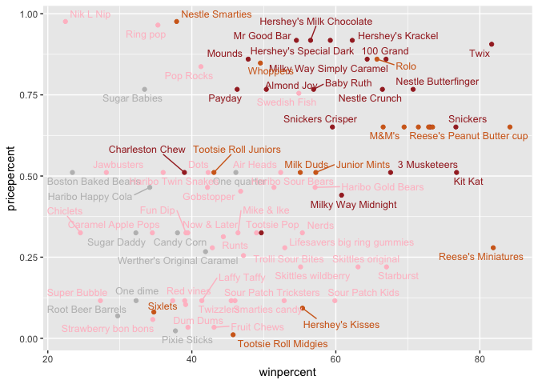

# Class09: Halloween Candy Mini Project
Lilith Sadil, A16470107

### Class 9 - 4.30.24

# Halloween Candy Mini Project

## 1. Importing Candy Data

In today’s class, we’ll examine data about candy from the “538” website.
We’ll start by importing the data:

``` r
candy_file <- "candy-data.txt"
```

Now, we’ll turn the

``` r
candy = read.csv(candy_file, row.names=1)
head(candy)
```

                 chocolate fruity caramel peanutyalmondy nougat crispedricewafer
    100 Grand            1      0       1              0      0                1
    3 Musketeers         1      0       0              0      1                0
    One dime             0      0       0              0      0                0
    One quarter          0      0       0              0      0                0
    Air Heads            0      1       0              0      0                0
    Almond Joy           1      0       0              1      0                0
                 hard bar pluribus sugarpercent pricepercent winpercent
    100 Grand       0   1        0        0.732        0.860   66.97173
    3 Musketeers    0   1        0        0.604        0.511   67.60294
    One dime        0   0        0        0.011        0.116   32.26109
    One quarter     0   0        0        0.011        0.511   46.11650
    Air Heads       0   0        0        0.906        0.511   52.34146
    Almond Joy      0   1        0        0.465        0.767   50.34755

> Q1. How many different candy types are in this dataset?

``` r
nrow(candy)
```

    [1] 85

There are 85 different candies in the data set.

> Q2. How many fruity candy types are in the data set?

``` r
sum(candy$fruity)
```

    [1] 38

There are 38 fruity candies in the data set.

## 2. What’s Your Favorite Candy?

> Q3. What is your favorite candy in the dataset and what is it’s
> winpercent value?

My favorite candy mentioned in the dataset is the Reese’s Peanut Butter
cup.

``` r
candy["Reese's Peanut Butter cup", ]$winpercent
```

    [1] 84.18029

The win percent of the Reese’s Peanut Butter cup is 84.18%.

> > Q4. What is the win percent value for “Kit Kat”?

``` r
candy["Kit Kat", ]$winpercent
```

    [1] 76.7686

The win percent for Kit Kat is 76.77%.

> Q5. What is the win percent value for “Tootsie Roll Snack Bars”?

``` r
candy["Tootsie Roll Snack Bars", ]$winpercent
```

    [1] 49.6535

The win percent of Tootsie Roll Snack Bars is 49.65%.

There’s a package called “skimr” which can help give a quick overview of
a data set

``` r
#install.packages("skimr")
library("skimr")
skimr::skim(candy)
```

|                                                  |       |
|:-------------------------------------------------|:------|
| Name                                             | candy |
| Number of rows                                   | 85    |
| Number of columns                                | 12    |
| \_\_\_\_\_\_\_\_\_\_\_\_\_\_\_\_\_\_\_\_\_\_\_   |       |
| Column type frequency:                           |       |
| numeric                                          | 12    |
| \_\_\_\_\_\_\_\_\_\_\_\_\_\_\_\_\_\_\_\_\_\_\_\_ |       |
| Group variables                                  | None  |

Data summary

**Variable type: numeric**

| skim_variable    | n_missing | complete_rate |  mean |    sd |    p0 |   p25 |   p50 |   p75 |  p100 | hist  |
|:-----------------|----------:|--------------:|------:|------:|------:|------:|------:|------:|------:|:------|
| chocolate        |         0 |             1 |  0.44 |  0.50 |  0.00 |  0.00 |  0.00 |  1.00 |  1.00 | ▇▁▁▁▆ |
| fruity           |         0 |             1 |  0.45 |  0.50 |  0.00 |  0.00 |  0.00 |  1.00 |  1.00 | ▇▁▁▁▆ |
| caramel          |         0 |             1 |  0.16 |  0.37 |  0.00 |  0.00 |  0.00 |  0.00 |  1.00 | ▇▁▁▁▂ |
| peanutyalmondy   |         0 |             1 |  0.16 |  0.37 |  0.00 |  0.00 |  0.00 |  0.00 |  1.00 | ▇▁▁▁▂ |
| nougat           |         0 |             1 |  0.08 |  0.28 |  0.00 |  0.00 |  0.00 |  0.00 |  1.00 | ▇▁▁▁▁ |
| crispedricewafer |         0 |             1 |  0.08 |  0.28 |  0.00 |  0.00 |  0.00 |  0.00 |  1.00 | ▇▁▁▁▁ |
| hard             |         0 |             1 |  0.18 |  0.38 |  0.00 |  0.00 |  0.00 |  0.00 |  1.00 | ▇▁▁▁▂ |
| bar              |         0 |             1 |  0.25 |  0.43 |  0.00 |  0.00 |  0.00 |  0.00 |  1.00 | ▇▁▁▁▂ |
| pluribus         |         0 |             1 |  0.52 |  0.50 |  0.00 |  0.00 |  1.00 |  1.00 |  1.00 | ▇▁▁▁▇ |
| sugarpercent     |         0 |             1 |  0.48 |  0.28 |  0.01 |  0.22 |  0.47 |  0.73 |  0.99 | ▇▇▇▇▆ |
| pricepercent     |         0 |             1 |  0.47 |  0.29 |  0.01 |  0.26 |  0.47 |  0.65 |  0.98 | ▇▇▇▇▆ |
| winpercent       |         0 |             1 | 50.32 | 14.71 | 22.45 | 39.14 | 47.83 | 59.86 | 84.18 | ▃▇▆▅▂ |

> Q6. Is there any variable/column that looks to be on a different scale
> to the majority of the other columns in the data set?

It appears that win percent is measured on a different scale compared to
the the rest of the rows.

> Q7. What do you think a zero and one represent for the
> candy\$chocolate column?

“0” and “1” in the `candy$chocolate` column likely refer to whether or
not a candy contains chocolate (0 for “no” and 1 for “yes”).

> Q8. Plot a histogram of win percent values

To make a simple plot, we can use the `hist` operation in R:

``` r
hist(candy$winpercent)
```


We can recreate this plot using ggplot:

``` r
library(ggplot2)

win_hist = ggplot(candy) +
  aes(candy$winpercent)+
  geom_histogram()
win_hist
```

    Warning: Use of `candy$winpercent` is discouraged.
    ℹ Use `winpercent` instead.

    `stat_bin()` using `bins = 30`. Pick better value with `binwidth`.


> Q9. Is the distribution of win percent values symmetrical?

The distribution of win percent values is not symmetrical; it’s slightly
skewed towards the left with a tail on the right.

> Q10. Is the center of the distribution above or below 50%?

``` r
summary(candy$winpercent)
```

       Min. 1st Qu.  Median    Mean 3rd Qu.    Max. 
      22.45   39.14   47.83   50.32   59.86   84.18 

The center of the distribution (median) lies at 47.83% which is roughly
in the middle but below 50%.

> Q11. On average is chocolate candy higher or lower ranked than fruit
> candy?

1.  We have to find all the chocolate candies,
2.  Find their win percents,
3.  And compare the mean of their win percents

``` r
chocolate_candy_win = candy$winpercent[as.logical(candy$chocolate)]
# or chocolate_candy = candy$winpercent[candy$chocolate==1]
chocolate_candy_win
```

     [1] 66.97173 67.60294 50.34755 56.91455 38.97504 55.37545 62.28448 56.49050
     [9] 59.23612 57.21925 76.76860 71.46505 66.57458 55.06407 73.09956 60.80070
    [17] 64.35334 47.82975 54.52645 70.73564 66.47068 69.48379 81.86626 84.18029
    [25] 73.43499 72.88790 65.71629 34.72200 37.88719 76.67378 59.52925 48.98265
    [33] 43.06890 45.73675 49.65350 81.64291 49.52411

This has provided us with the win percents of only the candies
containing chocolate. Now we can take the mean and compare them to fruit
candies

``` r
mean(chocolate_candy_win)
```

    [1] 60.92153

The average win percent of candy containing chocolate is 60.92%

``` r
fruit_candy_win = candy$winpercent[as.logical(candy$fruity)]
mean(fruit_candy_win)
```

    [1] 44.11974

The average win percent of candy containing fruit is 44.12%. From this,
we know that chocolate candies, on average, tend to be preferred over
fruity candies.

> Q12. Is this difference statistically significant?

To determine if the difference in preference between chocolate/fruity
candies is significant, we can use a t.test:

``` r
t.test(chocolate_candy_win, fruit_candy_win)
```


        Welch Two Sample t-test

    data:  chocolate_candy_win and fruit_candy_win
    t = 6.2582, df = 68.882, p-value = 2.871e-08
    alternative hypothesis: true difference in means is not equal to 0
    95 percent confidence interval:
     11.44563 22.15795
    sample estimates:
    mean of x mean of y 
     60.92153  44.11974 

Given that the p-value is very low (2.871e-08) when we compare these
data sets, there is a statistically significant difference in the data
sets.

## 3. Overall Candy Rankings

To sort numerical data, we can say:

``` r
x = c(5, 6, 4)
sort(x)
```

    [1] 4 5 6

`Order` works like `sort` but outputs the **order** of indicies which
would create a list of increasing values. (ex. here, we get “3, 1, 2” as
an output for the vector “5, 6, 4”). Now, we can insert tis list of
indicies back into x to order the data: 4, 5, 6.

``` r
order(x)
```

    [1] 3 1 2

``` r
x[order(x)]
```

    [1] 4 5 6

Now, we can use this knowledge to arrange the dataset by increasing win
percent and view it in several different ways:

``` r
index = order(candy$winpercent)
head(candy[index,]) #head shows us the first 6 items
```

                       chocolate fruity caramel peanutyalmondy nougat
    Nik L Nip                  0      1       0              0      0
    Boston Baked Beans         0      0       0              1      0
    Chiclets                   0      1       0              0      0
    Super Bubble               0      1       0              0      0
    Jawbusters                 0      1       0              0      0
    Root Beer Barrels          0      0       0              0      0
                       crispedricewafer hard bar pluribus sugarpercent pricepercent
    Nik L Nip                         0    0   0        1        0.197        0.976
    Boston Baked Beans                0    0   0        1        0.313        0.511
    Chiclets                          0    0   0        1        0.046        0.325
    Super Bubble                      0    0   0        0        0.162        0.116
    Jawbusters                        0    1   0        1        0.093        0.511
    Root Beer Barrels                 0    1   0        1        0.732        0.069
                       winpercent
    Nik L Nip            22.44534
    Boston Baked Beans   23.41782
    Chiclets             24.52499
    Super Bubble         27.30386
    Jawbusters           28.12744
    Root Beer Barrels    29.70369

``` r
tail(candy[index,]) #tail shows us the last 6 items
```

                              chocolate fruity caramel peanutyalmondy nougat
    Reese's pieces                    1      0       0              1      0
    Snickers                          1      0       1              1      1
    Kit Kat                           1      0       0              0      0
    Twix                              1      0       1              0      0
    Reese's Miniatures                1      0       0              1      0
    Reese's Peanut Butter cup         1      0       0              1      0
                              crispedricewafer hard bar pluribus sugarpercent
    Reese's pieces                           0    0   0        1        0.406
    Snickers                                 0    0   1        0        0.546
    Kit Kat                                  1    0   1        0        0.313
    Twix                                     1    0   1        0        0.546
    Reese's Miniatures                       0    0   0        0        0.034
    Reese's Peanut Butter cup                0    0   0        0        0.720
                              pricepercent winpercent
    Reese's pieces                   0.651   73.43499
    Snickers                         0.651   76.67378
    Kit Kat                          0.511   76.76860
    Twix                             0.906   81.64291
    Reese's Miniatures               0.279   81.86626
    Reese's Peanut Butter cup        0.651   84.18029

> Q13. What are the five least liked candy types in this set?

``` r
head(candy[index,], 5) #5 indicates that we only see the first 5 items 
```

                       chocolate fruity caramel peanutyalmondy nougat
    Nik L Nip                  0      1       0              0      0
    Boston Baked Beans         0      0       0              1      0
    Chiclets                   0      1       0              0      0
    Super Bubble               0      1       0              0      0
    Jawbusters                 0      1       0              0      0
                       crispedricewafer hard bar pluribus sugarpercent pricepercent
    Nik L Nip                         0    0   0        1        0.197        0.976
    Boston Baked Beans                0    0   0        1        0.313        0.511
    Chiclets                          0    0   0        1        0.046        0.325
    Super Bubble                      0    0   0        0        0.162        0.116
    Jawbusters                        0    1   0        1        0.093        0.511
                       winpercent
    Nik L Nip            22.44534
    Boston Baked Beans   23.41782
    Chiclets             24.52499
    Super Bubble         27.30386
    Jawbusters           28.12744

The 5 least liked candies on the list are: Nik L Nip, Boston Baked
Beans, Chiclets, Super Bubble, and Hawbusters

> Q14. What are the top 5 all time favorite candy types out of this set?

``` r
tail(candy[index,], 5) #5 indicates that we only see the last 5 items 
```

                              chocolate fruity caramel peanutyalmondy nougat
    Snickers                          1      0       1              1      1
    Kit Kat                           1      0       0              0      0
    Twix                              1      0       1              0      0
    Reese's Miniatures                1      0       0              1      0
    Reese's Peanut Butter cup         1      0       0              1      0
                              crispedricewafer hard bar pluribus sugarpercent
    Snickers                                 0    0   1        0        0.546
    Kit Kat                                  1    0   1        0        0.313
    Twix                                     1    0   1        0        0.546
    Reese's Miniatures                       0    0   0        0        0.034
    Reese's Peanut Butter cup                0    0   0        0        0.720
                              pricepercent winpercent
    Snickers                         0.651   76.67378
    Kit Kat                          0.511   76.76860
    Twix                             0.906   81.64291
    Reese's Miniatures               0.279   81.86626
    Reese's Peanut Butter cup        0.651   84.18029

The top five favorite candies are: Snickers, Kit Kat, Reese’s
Miniatures, and Reese’s Peanut Butter cups.

> Q15. Make a first barplot of candy ranking based on winpercent values.

``` r
library(ggplot2)

#| fig-height: 10
#| fig-width: 7

ggplot(candy)+
  aes(winpercent, rownames(candy))+
  geom_col()
```


> Q16. This is quite ugly, use the reorder() function to get the bars
> sorted by winpercent?

``` r
library(ggplot2)

#| fig-height: 10
#| fig-width: 7

ggplot(candy)+
  aes(winpercent, reorder(rownames(candy), winpercent))+
  geom_col()
```


We can adjust the plot to have a height of 10 upon rendering

``` r
ggsave("mybarplot.png", height=10)
```

    Saving 7 x 10 in image

\[Exported image that is a bit bigger so I can read it\] (mybarplot.png)

Now, we can change the chart so that fruity candies are pink, chocolates
are a chocolate color, and bars are brown. All candies which are none of
these three criteria appear gray.

``` r
my_cols=rep("gray", nrow(candy))
my_cols[as.logical(candy$chocolate)] = "chocolate"
my_cols[as.logical(candy$bar)] = "brown"
my_cols[candy$fruity == 1] = "pink"
```

``` r
ggplot(candy)+
  aes(winpercent, reorder(rownames(candy), winpercent))+
  geom_col(fill = my_cols)
```


> Q17. What is the worst ranked chocolate candy?

From the plot alone, we can see that the lowest ranked chocolate candy
is Sixlets.

> Q18. What is the best ranked fruity candy?

The best ranked fruity candy is Starburst.

Now, we are going to plot the win percent of candies against their price
points.

``` r
ggplot(candy)+
  aes(winpercent, pricepercent, label=rownames(candy))+
  geom_point(col=my_cols)+
  geom_label(col=my_cols)
```


We can use ggrepel to make sure that labels don’t overlap:

``` r
# install.packages("ggrepel")
library(ggrepel)
```

``` r
library(ggrepel)
ggplot(candy)+
  aes(winpercent, pricepercent, label=rownames(candy))+
  geom_point(col=my_cols)+
  geom_text_repel(col=my_cols, size=3.3, max.overlap=30)
```

    Warning in geom_text_repel(col = my_cols, size = 3.3, max.overlap = 30):
    Ignoring unknown parameters: `max.overlap`

    Warning: ggrepel: 10 unlabeled data points (too many overlaps). Consider
    increasing max.overlaps



> Q19. Which candy type is the highest ranked in terms of winpercent for
> the least money - i.e. offers the most bang for your buck?

It looks like Reese’s Miniatures are very highly ranked and have a
relatively low price point.

> Q20. What are the top 5 most expensive candy types in the dataset and
> of these which is the least popular?

``` r
ord <- order(candy$pricepercent, decreasing = TRUE)
head( candy[ord,c(11,12)], n=5 )
```

                             pricepercent winpercent
    Nik L Nip                       0.976   22.44534
    Nestle Smarties                 0.976   37.88719
    Ring pop                        0.965   35.29076
    Hershey's Krackel               0.918   62.28448
    Hershey's Milk Chocolate        0.918   56.49050

The five most expensive candies are:Nik L Nip, Nestle Smarties, Ring
Pops, Hershey’s Krackel, and Hershey’s Milk Chocolate. Of these, Nik L
Nip has the lowest win percentage (22.45%).

## 5. Exploring the Correlation Structure

``` r
#install.packages("corrplot")
library(corrplot)
```

    corrplot 0.92 loaded

``` r
cij=cor(candy)
head(cij)
```

                      chocolate     fruity     caramel peanutyalmondy      nougat
    chocolate         1.0000000 -0.7417211  0.24987535     0.37782357  0.25489183
    fruity           -0.7417211  1.0000000 -0.33548538    -0.39928014 -0.26936712
    caramel           0.2498753 -0.3354854  1.00000000     0.05935614  0.32849280
    peanutyalmondy    0.3778236 -0.3992801  0.05935614     1.00000000  0.21311310
    nougat            0.2548918 -0.2693671  0.32849280     0.21311310  1.00000000
    crispedricewafer  0.3412098 -0.2693671  0.21311310    -0.01764631 -0.08974359
                     crispedricewafer       hard        bar   pluribus sugarpercent
    chocolate              0.34120978 -0.3441769  0.5974211 -0.3396752   0.10416906
    fruity                -0.26936712  0.3906775 -0.5150656  0.2997252  -0.03439296
    caramel                0.21311310 -0.1223551  0.3339600 -0.2695850   0.22193335
    peanutyalmondy        -0.01764631 -0.2055566  0.2604196 -0.2061093   0.08788927
    nougat                -0.08974359 -0.1386750  0.5229764 -0.3103388   0.12308135
    crispedricewafer       1.00000000 -0.1386750  0.4237509 -0.2246934   0.06994969
                     pricepercent winpercent
    chocolate           0.5046754  0.6365167
    fruity             -0.4309685 -0.3809381
    caramel             0.2543271  0.2134163
    peanutyalmondy      0.3091532  0.4061922
    nougat              0.1531964  0.1993753
    crispedricewafer    0.3282654  0.3246797

For example, there’s a **positive** correlation between a candy having
chocolate and it also having peanuts or caramel. There’s also a positive
correlation between chocolate being both expensive (0.505) and having a
higher win percentage (0.634). Fruity candies also tend to be hard
candies (correleation = 0.391).

``` r
corrplot(cij)
```


> Q22. Examining this plot what two variables are anti-correlated
> (i.e. have minus values)?

The two variables with the strongest negative correlation are fruity &
chocolate. Additionally, pluribus & bar have a strong negative
correlation.

> Q23. Similarly, what two variables are most positively correlated?

Two variables with a strong positive correlation are chocolate &
winpercent (i.e. people tend to prefer candies made of chocolate).
Additionally chocolate & bar have a strong positive correlation
(i.e. bar candies tend to be made of chocolate).

## 6. Principal Component Analysis

We will perform a PCA of the candy. A key question is : do we need to
scale the data. Yes, we determined before that the win percentages are
out of 100 while the other values are between 0 and 1.

``` r
pca = prcomp(candy, scale=TRUE)
summary(pca)
```

    Importance of components:
                              PC1    PC2    PC3     PC4    PC5     PC6     PC7
    Standard deviation     2.0788 1.1378 1.1092 1.07533 0.9518 0.81923 0.81530
    Proportion of Variance 0.3601 0.1079 0.1025 0.09636 0.0755 0.05593 0.05539
    Cumulative Proportion  0.3601 0.4680 0.5705 0.66688 0.7424 0.79830 0.85369
                               PC8     PC9    PC10    PC11    PC12
    Standard deviation     0.74530 0.67824 0.62349 0.43974 0.39760
    Proportion of Variance 0.04629 0.03833 0.03239 0.01611 0.01317
    Cumulative Proportion  0.89998 0.93832 0.97071 0.98683 1.00000

After scaling, we see that the first principal component (PC1) only
captures 36.0% of the total variance. Adding a second pc accounts for
not quite half (46.8%) of the data

An initial plot in R helps us plot PCA1 and PCA2

``` r
plot(pca$x[,1], pca$x[,2], col=my_cols, pch=16)
```


Now, we’ll make this plot in ggplot, adding labels:

``` r
my_data=cbind(candy, pca$x[,1:3])

ggplot(my_data)+
  aes(PC1, PC2, label=rownames(my_data))+
  geom_point(col=my_cols)+
  geom_text_repel(col=my_cols)
```

    Warning: ggrepel: 21 unlabeled data points (too many overlaps). Consider
    increasing max.overlaps


We can add all sorts of fancy code to make the plot look a bit nicer:

``` r
p <- ggplot(my_data) + 
        aes(x=PC1, y=PC2, 
            size=winpercent/100,  
            text=rownames(my_data),
            label=rownames(my_data)) +
        geom_point(col=my_cols)

p + geom_text_repel(size=3.3, col=my_cols, max.overlaps = 7)  + 
  theme(legend.position = "none") +
  labs(title="Halloween Candy PCA Space",
       subtitle="Colored by type: chocolate bar (dark brown), chocolate other (light brown), fruity (red), other (black)",
       caption="Data from 538")
```

    Warning: ggrepel: 39 unlabeled data points (too many overlaps). Consider
    increasing max.overlaps


If we want to make the chart interactive (ex. hover over point to show
its details), we can use plotly

``` r
#install.packages("plotly")
#library(plotly)
#ggplotly(p)
```

We can also make a bar plot to show the positive and negative
correlations between certain candy attribute. (ex. items along the
positive axis correlate with one another - fruity candies tend to be
hard and in multi packs; fruity candies tend to NOT have caramel or
nougat…)

``` r
par(mar=c(8,4,2,2))
barplot(pca$rotation[,1], las=2, ylab="PC1 Contribution")
```


``` r
res =as.data.frame(pca$rotation)

ggplot(res)+
  aes(PC1, reorder(rownames(res), PC1))+
  geom_col()
```


> Q24. What original variables are picked up strongly by PC1 in the
> positive direction? Do these make sense to you?

PC1 picked up “fruity”, “pluribus”, and “hard” all strongly in the
positive direction. This is because our earlier correlation analysis
found that fruity candies tend to come in multi-packs and are hard.
