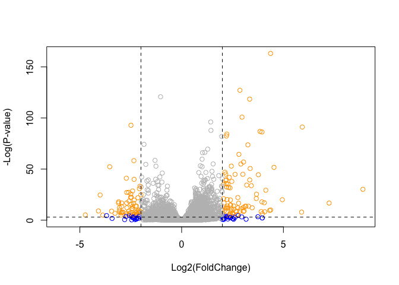

# Class 13: RNASeq

## Importing Necessary Packages

First, we’ll have to install the “bio conductor” package

``` r
#install.packages("BiocManager")
#BiocManager::install()
```

Next, we’ll install the DESeq2 data set within the BiocManager package

``` r
#BiocManager::install("DESeq2")
```

``` r
library("DESeq2")
```

## Class Background

The data for today’s lab comes from a published RNA-Seq experiment where
airway smooth muscle cells were treated with dexamethasone, a synthetic
glucocorticoid steroid with anti-inflammatory effects.

## Import Data

We need two things for this analysis: counts and metadata - called
“countData” & “colData” in the DESeq2 world.

``` r
counts = read.csv("airway_scaledcounts.csv", row.names=1)
metadata = read.csv("airway_metadata.csv")
```

## Examine Data

> Q1. How many genes are in this dataset?

``` r
nrow(counts)
```

    [1] 38694

We can see that there are 38694 genes in the dataset.

> Q2. How many ‘control’ cell lines do we have?

``` r
table(metadata$dex)
```


    control treated 
          4       4 

``` r
#Or 
sum(metadata$dex=="control")
```

    [1] 4

There are 4 control cell lines included in the metadata.

### Check to ensure that the metadata & coldata match in their orders:

In order for our later analysis to work, we have to make sure that the
column names in our first dataset are in the exact same order as the
rows in our second data set:

``` r
all(colnames(counts) == metadata$id)
```

    [1] TRUE

``` r
#Note: all(c(T,T,T)) = TRUE but all(c(T,T,F)) = FALSE ; only true is all values are true
```

Since all the returned values are true, our ordering is correct and we
may proceed.

## Analysis

Next, we want to compare the cases where cells received drugs vs control
groups (i.e. the “control” vs “treated” columns). We can begin our
analysis by finding the average expression for each gene among each of
the 4 control/treated columns.

Let’s extract all the “control” columns first from the metadata dataset:

``` r
control.inds = metadata$dex=="control"
control.counts = counts[,control.inds]
head(control.counts)
```

                    SRR1039508 SRR1039512 SRR1039516 SRR1039520
    ENSG00000000003        723        904       1170        806
    ENSG00000000005          0          0          0          0
    ENSG00000000419        467        616        582        417
    ENSG00000000457        347        364        318        330
    ENSG00000000460         96         73        118        102
    ENSG00000000938          0          1          2          0

> Q3. How would you make the above code in either approach more robust?
> Is there a function that could help here?

Now we can calculate the mean expression for each gene in the control
groups using an `apply()` operation:

``` r
head(apply(control.counts,1,mean))
```

    ENSG00000000003 ENSG00000000005 ENSG00000000419 ENSG00000000457 ENSG00000000460 
             900.75            0.00          520.50          339.75           97.25 
    ENSG00000000938 
               0.75 

``` r
#Note: we use "1" here since we're trying to average the expression of each gene across each of the 4 control experiments
# We're using "head" here to avoid showing all 38,000 genes
```

> Q4. Follow the same procedure for the treated samples (i.e. calculate
> the mean per gene across drug treated samples and assign to a labeled
> vector called treated.mean)

Now we can do the same to calculate the mean expression per gene among
the “treated” group:

``` r
treated.inds = metadata$dex=="treated"
treated.counts = counts[,treated.inds]
head(apply(treated.counts,1,mean))
```

    ENSG00000000003 ENSG00000000005 ENSG00000000419 ENSG00000000457 ENSG00000000460 
             658.00            0.00          546.00          316.50           78.75 
    ENSG00000000938 
               0.00 

Now that we’ve averaged the expression of each gene in the control
vs. treated groups, we can go on to compare the expression of genes
between groups to see if the drug treatment impacted the expression of
certain genes:

Here, we’ll create a new data frame with the mean gene expression counts
from each group:

``` r
#assigning the mean expression to a new variable for control vs mean
control.mean = apply(control.counts,1,mean)
treated.mean = apply(treated.counts,1,mean)

#creating a new data frame with the mean treated vs control data:
meancounts = data.frame(control.mean, treated.mean)
head(meancounts)
```

                    control.mean treated.mean
    ENSG00000000003       900.75       658.00
    ENSG00000000005         0.00         0.00
    ENSG00000000419       520.50       546.00
    ENSG00000000457       339.75       316.50
    ENSG00000000460        97.25        78.75
    ENSG00000000938         0.75         0.00

> Q5 (a). Create a scatter plot showing the mean of the treated samples
> against the mean of the control samples.

Now, we can make a plot to compare the control vs. mean expression data.
If the drug did nothing, then we should observe all genes along a
straight, diagonal line:

``` r
#plot(meancounts$control.mean, meancounts$treated) or simply...
plot(meancounts)
```


From this initial plot, we can see that certain genes fall above/below
the line. Genes that are above the diagonal have their expression
upregulated by the drug treatment while genes below the line decrease in
expression upon treatment.

> Q5 (b).You could also use the ggplot2 package to make this figure
> producing the plot below. What geom\_?() function would you use for
> this plot?

If we were to use ggplot, then we would want to use a geom_point
function.

> Q6. Try plotting both axes on a log scale. What is the argument to
> plot() that allows you to do this?

Since it looks like most of the data is clustered in the bottom left of
the plot, we should rescale the axis using a log function, specifically,
log=“xy”.

``` r
plot(meancounts, log="xy")
```

    Warning in xy.coords(x, y, xlabel, ylabel, log): 15032 x values <= 0 omitted
    from logarithmic plot

    Warning in xy.coords(x, y, xlabel, ylabel, log): 15281 y values <= 0 omitted
    from logarithmic plot


Now we can better see the spread of genes along the diagonal. There is
more spread/variety of expression towards the bottom left of the graph
(genes which are expressed at lower levels tend to have more variety
upon being treated with the drug).

We often use log2 units to further analyze this kind of data since it
helps us assign values to describe the deviation of each gene’s
expression from the diagnoal (i.e. no change).

``` r
log2(10/10)
```

    [1] 0

``` r
#This is the same as saying log2(1) which equals 0; in this, case, any item in our graph that falls along the exact diagonal (ex. 10/10) will be equal to 0 once we run it through a log
log2(20/10)
```

    [1] 1

``` r
#if one variable is 2x as much as the other, then the return is 1
log2(10/20)
```

    [1] -1

``` r
#if one variable is 1/2x as much as the other, then the return is -1
log2(40/10)
```

    [1] 2

``` r
#if expression is quadrupled upon treatment, then the return is 2
```

Let’s create a column in a new data frame which includes the log2 of the
y/x data (treated/control)

``` r
meancounts$log2fc <- log2(meancounts[,"treated.mean"]/meancounts[,"control.mean"])
head(meancounts)
```

                    control.mean treated.mean      log2fc
    ENSG00000000003       900.75       658.00 -0.45303916
    ENSG00000000005         0.00         0.00         NaN
    ENSG00000000419       520.50       546.00  0.06900279
    ENSG00000000457       339.75       316.50 -0.10226805
    ENSG00000000460        97.25        78.75 -0.30441833
    ENSG00000000938         0.75         0.00        -Inf

Negative values are downregulated genes upon treatement, positive values
are upregulated. Typically, we care about log2 values which are more
extreme than +2 or -2 (quadrupling effect on gene expression from the
drug).

The NaN values arise from instances where we divide by 0. -Inf values
arise from trying to take the log of 0. We should remove these values
from our data set in order to continue our numerical analysis.

``` r
zero.vals = which(meancounts[,1:2]==0, arr.ind=TRUE)
# or to.keep.inds = (rowSums(meancounts[,1:2]==0)==0)
# mycounts = meancounts[to.keep.inds]

to.rm = unique(zero.vals[,1])
mycounts = meancounts[-to.rm,]
#removes instances of to.rm in our meancounts data

head(mycounts)
```

                    control.mean treated.mean      log2fc
    ENSG00000000003       900.75       658.00 -0.45303916
    ENSG00000000419       520.50       546.00  0.06900279
    ENSG00000000457       339.75       316.50 -0.10226805
    ENSG00000000460        97.25        78.75 -0.30441833
    ENSG00000000971      5219.00      6687.50  0.35769358
    ENSG00000001036      2327.00      1785.75 -0.38194109

``` r
#modified mycounts to not have NaN and -Inf values
```

> Q7. What is the purpose of the arr.ind argument in the which()
> function call above?

In the function call above, “arr.ind==TRUE” in the `which()` statement
serves to return data points where it is “TRUE” that the first two
columns contain a “0”.

``` r
nrow(mycounts)
```

    [1] 21817

After filtering out the 0 values, we have 21817 genes left.

Before, we stated that a log2 value of +2 or -2 serves as a threshold to
consider it “up” or “down” regulated.

``` r
sum(mycounts$log2fc>=2)
```

    [1] 314

``` r
sum(mycounts$log2fc<=-2)
```

    [1] 485

> Q8. Using the up.ind vector above can you determine how many up
> regulated genes we have at the greater than 2 fc level?

We didn’t end up using the up.ind vector, but we did discover that that
314 genes were upregulated enough to produce a log2 value of 2 or
greater.

> Q9. Using the down.ind vector above can you determine how many down
> regulated genes we have at the greater than 2 fc level?

Again, we didn’t end up using the down.ind vector, but we did discover
that that 485 genes were downregulated enough to produce a log2 value of
-2 or lower

> Q10. Do you trust these results? Why or why not?

Still, we’re missing a statistical analysis which indicates that the
variance we’re seeing isn’t due to just natural variation among the 4
experiments that we started with (for each control/treated group); we
need something like a standard deviation. To do this statistical
analysis, we’ll use DESeq:

``` r
library(DESeq2)
```

To use DESeq, we have to get our input data in a very particular format

``` r
dds = DESeqDataSetFromMatrix(countData = counts,
                       colData = metadata,
                       design = ~dex) #design is the dex column; control vs treated
```

    converting counts to integer mode

    Warning in DESeqDataSet(se, design = design, ignoreRank): some variables in
    design formula are characters, converting to factors

``` r
dds 
```

    class: DESeqDataSet 
    dim: 38694 8 
    metadata(1): version
    assays(1): counts
    rownames(38694): ENSG00000000003 ENSG00000000005 ... ENSG00000283120
      ENSG00000283123
    rowData names(0):
    colnames(8): SRR1039508 SRR1039509 ... SRR1039520 SRR1039521
    colData names(4): id dex celltype geo_id

Now, we’ll run DESeq:

``` r
dds = DESeq(dds)
```

    estimating size factors

    estimating dispersions

    gene-wise dispersion estimates

    mean-dispersion relationship

    final dispersion estimates

    fitting model and testing

``` r
res = results(dds)
head(res)
```

    log2 fold change (MLE): dex treated vs control 
    Wald test p-value: dex treated vs control 
    DataFrame with 6 rows and 6 columns
                      baseMean log2FoldChange     lfcSE      stat    pvalue
                     <numeric>      <numeric> <numeric> <numeric> <numeric>
    ENSG00000000003 747.194195     -0.3507030  0.168246 -2.084470 0.0371175
    ENSG00000000005   0.000000             NA        NA        NA        NA
    ENSG00000000419 520.134160      0.2061078  0.101059  2.039475 0.0414026
    ENSG00000000457 322.664844      0.0245269  0.145145  0.168982 0.8658106
    ENSG00000000460  87.682625     -0.1471420  0.257007 -0.572521 0.5669691
    ENSG00000000938   0.319167     -1.7322890  3.493601 -0.495846 0.6200029
                         padj
                    <numeric>
    ENSG00000000003  0.163035
    ENSG00000000005        NA
    ENSG00000000419  0.176032
    ENSG00000000457  0.961694
    ENSG00000000460  0.815849
    ENSG00000000938        NA

Running this analysis yields p-values for the expression of each gene.
Typically, we use a threshold of 0.05 for a statistically significant
p-value. Additionally, we have an adjusted pvalue (padj) output which
accounts for the size of the dataset (thousands of genes).

To end off for today, let’s make a figure showing an overview of all the
results we’ve obtained (a plot of **log2 fold chang**e vs. **the
adjusted p-value**)

``` r
plot(res$log2FoldChange, res$padj)
```


In the resulting plot, we don’t care about values which are high on the
x-axis (large p-value, insignificant statistically).

Now, we can take the log of the y-axis and invert the graph so that
points near the top of the graph are significant. (left side =
significantly downregulated, right side = significantly upregulated).
We’ve also gone ahead and drawn thresholds at log2 values of +2 and -2
as well as a horizontal line at a p-value of 0.05 (we have to apply the
-log function to the p-value to draw the line in the correct position).

``` r
plot(res$log2FoldChange, -log(res$padj))
abline(v=-2, col="gray")
abline(v=2, col="gray")
abline(h=-log(0.05), col="grey")
```


Genes located in the top left and top right of the plots are the
significantly up-regulated/down-regulated genes that we care about.

``` r
mycols = rep("gray", nrow(res))
mycols[ abs(res$log2FoldChange) > 2 ] = "blue" 

inds <- (res$padj < 0.01) & (abs(res$log2FoldChange) > 2 )
mycols[ inds ] = "orange"

plot( res$log2FoldChange,  -log(res$padj), 
 col=mycols, ylab="-Log(P-value)", xlab="Log2(FoldChange)" )

abline(v=c(-2,2), col="black", lty=2)
abline(h=-log(0.05), col="black", lty=2)
```



## Finishing up the Lab (5.16.24)

### Adding Annotation Data

We want to add gene symbols (i.e. their names) as well as common
identifiers from major databases to all of our genes of interest (the
orange genes in our previously made graph)

First, we have to install & library our main Bioconductor annotation
packages:

``` r
#BiocManager::install("AnnotationDbi")
#BiocManager::install("org.Hs.eg.db")
library("AnnotationDbi")
library("org.Hs.eg.db")
```

We can translate between the following IDs:

``` r
columns(org.Hs.eg.db)
```

     [1] "ACCNUM"       "ALIAS"        "ENSEMBL"      "ENSEMBLPROT"  "ENSEMBLTRANS"
     [6] "ENTREZID"     "ENZYME"       "EVIDENCE"     "EVIDENCEALL"  "GENENAME"    
    [11] "GENETYPE"     "GO"           "GOALL"        "IPI"          "MAP"         
    [16] "OMIM"         "ONTOLOGY"     "ONTOLOGYALL"  "PATH"         "PFAM"        
    [21] "PMID"         "PROSITE"      "REFSEQ"       "SYMBOL"       "UCSCKG"      
    [26] "UNIPROT"     

``` r
head(res)
```

    log2 fold change (MLE): dex treated vs control 
    Wald test p-value: dex treated vs control 
    DataFrame with 6 rows and 6 columns
                      baseMean log2FoldChange     lfcSE      stat    pvalue
                     <numeric>      <numeric> <numeric> <numeric> <numeric>
    ENSG00000000003 747.194195     -0.3507030  0.168246 -2.084470 0.0371175
    ENSG00000000005   0.000000             NA        NA        NA        NA
    ENSG00000000419 520.134160      0.2061078  0.101059  2.039475 0.0414026
    ENSG00000000457 322.664844      0.0245269  0.145145  0.168982 0.8658106
    ENSG00000000460  87.682625     -0.1471420  0.257007 -0.572521 0.5669691
    ENSG00000000938   0.319167     -1.7322890  3.493601 -0.495846 0.6200029
                         padj
                    <numeric>
    ENSG00000000003  0.163035
    ENSG00000000005        NA
    ENSG00000000419  0.176032
    ENSG00000000457  0.961694
    ENSG00000000460  0.815849
    ENSG00000000938        NA

My IDs are in the `rownames(res)` and they are from ENSEMBL. We can
reference online databases in order to “translate” the ENSG…. name of
our genes into their more well-known gene names. Further, we’ve stored
this information into a new column in the “res” dataset called “symbol”:

``` r
res$symbol = mapIds(org.Hs.eg.db,
       keys=row.names(res), # Our genenames
       keytype="ENSEMBL",   # The format of our genenames
       column="SYMBOL",     # The new format we want to add
       multiVals="first")
```

    'select()' returned 1:many mapping between keys and columns

``` r
head(res)
```

    log2 fold change (MLE): dex treated vs control 
    Wald test p-value: dex treated vs control 
    DataFrame with 6 rows and 7 columns
                      baseMean log2FoldChange     lfcSE      stat    pvalue
                     <numeric>      <numeric> <numeric> <numeric> <numeric>
    ENSG00000000003 747.194195     -0.3507030  0.168246 -2.084470 0.0371175
    ENSG00000000005   0.000000             NA        NA        NA        NA
    ENSG00000000419 520.134160      0.2061078  0.101059  2.039475 0.0414026
    ENSG00000000457 322.664844      0.0245269  0.145145  0.168982 0.8658106
    ENSG00000000460  87.682625     -0.1471420  0.257007 -0.572521 0.5669691
    ENSG00000000938   0.319167     -1.7322890  3.493601 -0.495846 0.6200029
                         padj      symbol
                    <numeric> <character>
    ENSG00000000003  0.163035      TSPAN6
    ENSG00000000005        NA        TNMD
    ENSG00000000419  0.176032        DPM1
    ENSG00000000457  0.961694       SCYL3
    ENSG00000000460  0.815849       FIRRM
    ENSG00000000938        NA         FGR

We also want to repeat this process to obtain “GENENAME” (what the gene
does) and “ENTREZID” (ID of the gene in the ENTREZ database):

``` r
res$genename = mapIds(org.Hs.eg.db,
       keys=row.names(res), # Our genenames
       keytype="ENSEMBL",   # The format of our genenames
       column="GENENAME",     # The new format we want to add
       multiVals="first")
```

    'select()' returned 1:many mapping between keys and columns

``` r
res$entrezid = mapIds(org.Hs.eg.db,
       keys=row.names(res), # Our genenames
       keytype="ENSEMBL",   # The format of our genenames
       column="ENTREZID",     # The new format we want to add
       multiVals="first")
```

    'select()' returned 1:many mapping between keys and columns

``` r
head(res)
```

    log2 fold change (MLE): dex treated vs control 
    Wald test p-value: dex treated vs control 
    DataFrame with 6 rows and 9 columns
                      baseMean log2FoldChange     lfcSE      stat    pvalue
                     <numeric>      <numeric> <numeric> <numeric> <numeric>
    ENSG00000000003 747.194195     -0.3507030  0.168246 -2.084470 0.0371175
    ENSG00000000005   0.000000             NA        NA        NA        NA
    ENSG00000000419 520.134160      0.2061078  0.101059  2.039475 0.0414026
    ENSG00000000457 322.664844      0.0245269  0.145145  0.168982 0.8658106
    ENSG00000000460  87.682625     -0.1471420  0.257007 -0.572521 0.5669691
    ENSG00000000938   0.319167     -1.7322890  3.493601 -0.495846 0.6200029
                         padj      symbol               genename    entrezid
                    <numeric> <character>            <character> <character>
    ENSG00000000003  0.163035      TSPAN6          tetraspanin 6        7105
    ENSG00000000005        NA        TNMD            tenomodulin       64102
    ENSG00000000419  0.176032        DPM1 dolichyl-phosphate m..        8813
    ENSG00000000457  0.961694       SCYL3 SCY1 like pseudokina..       57147
    ENSG00000000460  0.815849       FIRRM FIGNL1 interacting r..       55732
    ENSG00000000938        NA         FGR FGR proto-oncogene, ..        2268

Let’s save our results to a new CSV file by using the `write.csv()`
operation. This is good for sharing data between colleagues:

``` r
write.csv(res, file="myresults.csv")
```

### Pathway Analysis

We’ll need to install a few more packages in order to proceed with a
pathway analysis:

``` r
#BiocManager::install( c("pathview", "gage", "gageData") )
library(pathview)
library(gage)
library(gageData)
```

Here, we’re calling upon the kegg database (a genomics databse from
Kyoto). It will return gene IDs that are known to be involved in certain
pathways/processes (ex. gene ID#10 is involved in caffeine metabolism):

``` r
data(kegg.sets.hs)
head(kegg.sets.hs, 2) #Examines the first 2 pathways in this kegg set for humans
```

    $`hsa00232 Caffeine metabolism`
    [1] "10"   "1544" "1548" "1549" "1553" "7498" "9"   

    $`hsa00983 Drug metabolism - other enzymes`
     [1] "10"     "1066"   "10720"  "10941"  "151531" "1548"   "1549"   "1551"  
     [9] "1553"   "1576"   "1577"   "1806"   "1807"   "1890"   "221223" "2990"  
    [17] "3251"   "3614"   "3615"   "3704"   "51733"  "54490"  "54575"  "54576" 
    [25] "54577"  "54578"  "54579"  "54600"  "54657"  "54658"  "54659"  "54963" 
    [33] "574537" "64816"  "7083"   "7084"   "7172"   "7363"   "7364"   "7365"  
    [41] "7366"   "7367"   "7371"   "7372"   "7378"   "7498"   "79799"  "83549" 
    [49] "8824"   "8833"   "9"      "978"   

To run gage, we need to provide it with a vector of fold-change values
(not our full results table)

``` r
foldchanges = res$log2FoldChange
#foldchanges
```

Now, we’ll add the ENTREZ ids as names to our foldchanges vector:

``` r
names(foldchanges) = res$entrezid
head(foldchanges)
```

           7105       64102        8813       57147       55732        2268 
    -0.35070302          NA  0.20610777  0.02452695 -0.14714205 -1.73228897 

Now, we’ll run **gage** with this input and the KEGG pathways:

``` r
keggres = gage(foldchanges, gsets = kegg.sets.hs)
attributes(keggres)
```

    $names
    [1] "greater" "less"    "stats"  

``` r
head(keggres$less)
```

                                                             p.geomean stat.mean
    hsa05332 Graft-versus-host disease                    0.0004250461 -3.473346
    hsa04940 Type I diabetes mellitus                     0.0017820293 -3.002352
    hsa05310 Asthma                                       0.0020045888 -3.009050
    hsa04672 Intestinal immune network for IgA production 0.0060434515 -2.560547
    hsa05330 Allograft rejection                          0.0073678825 -2.501419
    hsa04340 Hedgehog signaling pathway                   0.0133239547 -2.248547
                                                                 p.val      q.val
    hsa05332 Graft-versus-host disease                    0.0004250461 0.09053483
    hsa04940 Type I diabetes mellitus                     0.0017820293 0.14232581
    hsa05310 Asthma                                       0.0020045888 0.14232581
    hsa04672 Intestinal immune network for IgA production 0.0060434515 0.31387180
    hsa05330 Allograft rejection                          0.0073678825 0.31387180
    hsa04340 Hedgehog signaling pathway                   0.0133239547 0.47300039
                                                          set.size         exp1
    hsa05332 Graft-versus-host disease                          40 0.0004250461
    hsa04940 Type I diabetes mellitus                           42 0.0017820293
    hsa05310 Asthma                                             29 0.0020045888
    hsa04672 Intestinal immune network for IgA production       47 0.0060434515
    hsa05330 Allograft rejection                                36 0.0073678825
    hsa04340 Hedgehog signaling pathway                         56 0.0133239547

Let’s look at the hsa05310 Asthma pathway with our genes highlighted
using the `pathview()` function:

``` r
pathview(gene.data=foldchanges, pathway.id="hsa05310")
```

    'select()' returned 1:1 mapping between keys and columns

    Info: Working in directory /Users/lilith.sadil/Desktop/RStudio Projects/bimm143_github/Class13

    Info: Writing image file hsa05310.pathview.png

We’re returned a pathway involving the asthma genes. Let’s insert that
image into our document: 
