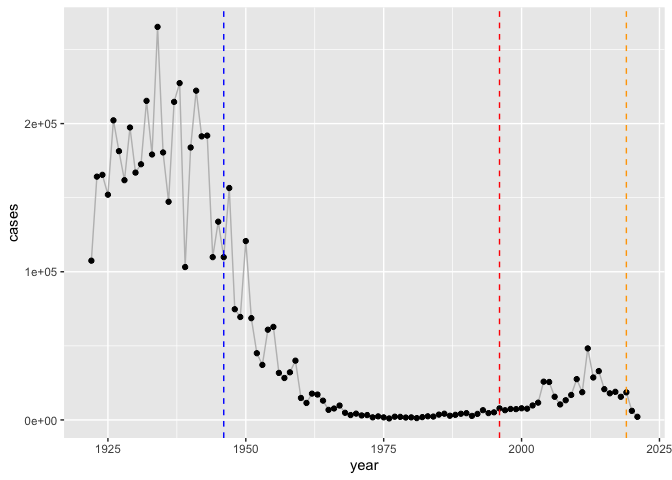
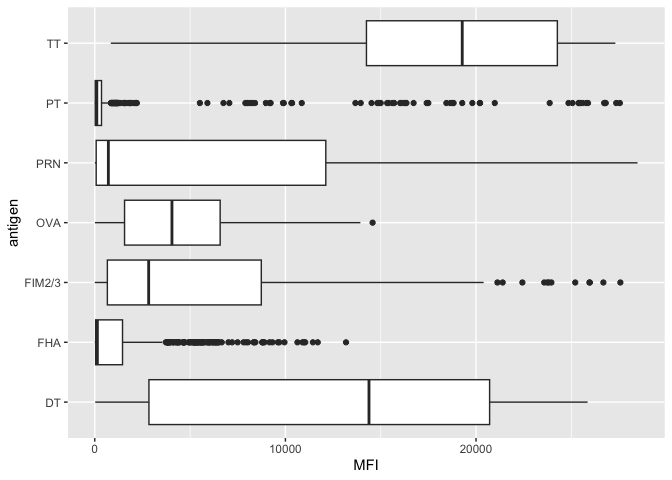
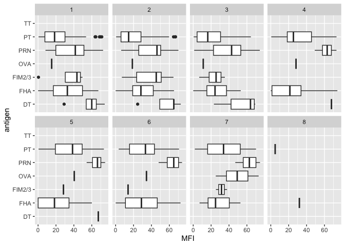
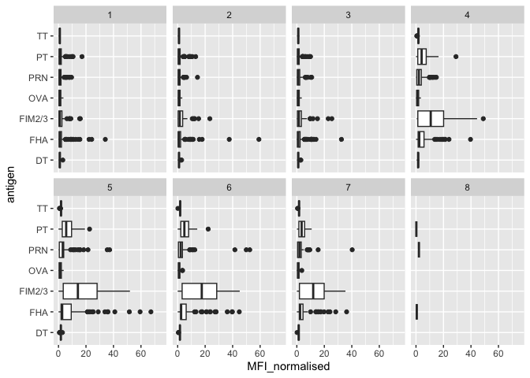
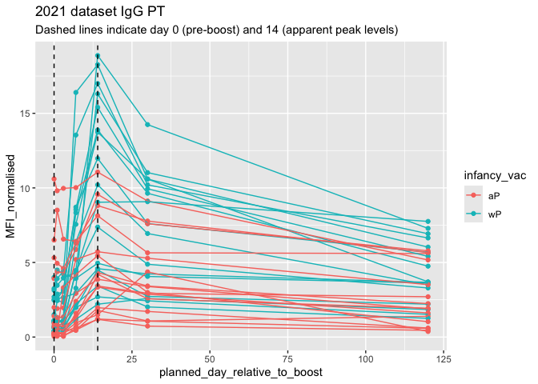

# Class 18 - Pertussis and the CMI-PB project
Lilith Sadil

## Background

Pertussis (whooping cough) is a highly contagious lung infection which
is most deadly among infants.

## Investigating pertussis cases by year

Let’s start by looking at the number of Pertussis cases/year in the U.S.

The CDC tracks Pertussis cases, making the data available here:

https://www.cdc.gov/pertussis/php/surveillance/pertussis-cases-by-year.html

We can use a package called `datapasta` to extract tables/data from a
web page where a file for the data is not provided:

``` r
library(datapasta)
cdc = data.frame(year = c(1922L,1923L,1924L,1925L,1926L,
                                         1927L,1928L,1929L,1930L,1931L,
                                         1932L,1933L,1934L,1935L,1936L,1937L,
                                         1938L,1939L,1940L,1941L,1942L,
                                         1943L,1944L,1945L,1946L,1947L,1948L,
                                         1949L,1950L,1951L,1952L,1953L,1954L,
                                         1955L,1956L,1957L,1958L,1959L,
                                         1960L,1961L,1962L,1963L,1964L,1965L,
                                         1966L,1967L,1968L,1969L,1970L,
                                         1971L,1972L,1973L,1974L,1975L,1976L,
                                         1977L,1978L,1979L,1980L,1981L,
                                         1982L,1983L,1984L,1985L,1986L,1987L,
                                         1988L,1989L,1990L,1991L,1992L,1993L,
                                         1994L,1995L,1996L,1997L,1998L,
                                         1999L,2000L,2001L,2002L,2003L,2004L,
                                         2005L,2006L,2007L,2008L,2009L,
                                         2010L,2011L,2012L,2013L,2014L,2015L,
                                         2016L,2017L,2018L,2019L,2020L,
                                         2021L),
        cases = c(107473,164191,165418,152003,
                                         202210,181411,161799,197371,166914,
                                         172559,215343,179135,265269,180518,
                                         147237,214652,227319,103188,183866,
                                         222202,191383,191890,109873,133792,
                                         109860,156517,74715,69479,120718,
                                         68687,45030,37129,60886,62786,
                                         31732,28295,32148,40005,14809,11468,
                                         17749,17135,13005,6799,7717,9718,
                                         4810,3285,4249,3036,3287,1759,
                                         2402,1738,1010,2177,2063,1623,1730,
                                         1248,1895,2463,2276,3589,4195,
                                         2823,3450,4157,4570,2719,4083,6586,
                                         4617,5137,7796,6564,7405,7298,
                                         7867,7580,9771,11647,25827,25616,
                                         15632,10454,13278,16858,27550,18719,
                                         48277,28639,32971,20762,17972,
                                         18975,15609,18617,6124,2116)
      )
```

## A tale of two vaccines (wP & aP)

> Q2. Now that we’ve added the CDC table in as a data frame, let’s make
> a graph of the cases per year:

``` r
library(ggplot2)
ggplot(cdc) +
  aes(x=year,y=cases) + 
  geom_line(col = "grey")+
  geom_point(col="black")+
  geom_vline(xintercept=1946, col="blue", linetype=2)+
  geom_vline(xintercept = 1996, col="red", linetype=2)+
  geom_vline(xintercept = 2019, col="orange", linetype=2)
```



Two vertical lines have been included to show where the wP & aP vaccines
were implemented.

> Q3. Describe what happened after the introduction of the aP vaccine?
> Do you have a possible explanation for the observed trend?

Shortly after the aP vaccine was introduced in ~2000, the anti-vaccine
movement began which could contribute to the rise again in cases around
the time. Additionally, the acellular vaccine could have slightly lower
efficacy since it doesn’t cause the same strength of antigen response as
the the full cell vaccine.

## Exploring CMI-PB data

CMI-PB is a systems vaccinology project which focuses on discerning the
differences between aP and wP immune responses:

The resource has an API (application programming interface) which
returns JSON formatted data in key-value pairs:

``` r
library(jsonlite)
subject = read_json("https://www.cmi-pb.org/api/subject", simplifyVector = TRUE) 
head(subject, 3) #view information from the first three subjects
```

      subject_id infancy_vac biological_sex              ethnicity  race
    1          1          wP         Female Not Hispanic or Latino White
    2          2          wP         Female Not Hispanic or Latino White
    3          3          wP         Female                Unknown White
      year_of_birth date_of_boost      dataset
    1    1986-01-01    2016-09-12 2020_dataset
    2    1968-01-01    2019-01-28 2020_dataset
    3    1983-01-01    2016-10-10 2020_dataset

> How many individuals are in the dataset?

``` r
nrow(subject)
```

    [1] 118

There are 118 individuals in the dataset.

> Q4. How many aP and wP infancy vaccinated subjects are in the dataset?

``` r
table(subject$infancy_vac)
```


    aP wP 
    60 58 

60 individuals were infants vaccinated with the aP vaccine & 58
individuals were infants vaccinated with the wP vaccine

> Q5. How many Male and Female subjects/patients are in the dataset?

``` r
table(subject$biological_sex)
```


    Female   Male 
        79     39 

There were 79 female participants and 39 male participants in the study.

> Q6. What is the breakdown of race and biological sex (e.g. number of
> Asian females, White males etc…)?

``` r
table(subject$race, subject$biological_sex)
```

                                               
                                                Female Male
      American Indian/Alaska Native                  0    1
      Asian                                         21   11
      Black or African American                      2    0
      More Than One Race                             9    2
      Native Hawaiian or Other Pacific Islander      1    1
      Unknown or Not Reported                       11    4
      White                                         35   20

The table generated above displays the breakdown of race & gender in the
study.

Next, we’ll download some more data from the CMI-PB site:

``` r
specimen = read_json("http://cmi-pb.org/api/specimen", simplifyVector = TRUE) 
ab_titer = read_json("http://cmi-pb.org/api/v4/plasma_ab_titer", simplifyVector=TRUE)

head(subject, 3)
```

      subject_id infancy_vac biological_sex              ethnicity  race
    1          1          wP         Female Not Hispanic or Latino White
    2          2          wP         Female Not Hispanic or Latino White
    3          3          wP         Female                Unknown White
      year_of_birth date_of_boost      dataset
    1    1986-01-01    2016-09-12 2020_dataset
    2    1968-01-01    2019-01-28 2020_dataset
    3    1983-01-01    2016-10-10 2020_dataset

``` r
head(ab_titer, 3)
```

      specimen_id isotype is_antigen_specific antigen        MFI MFI_normalised
    1           1     IgE               FALSE   Total 1110.21154       2.493425
    2           1     IgE               FALSE   Total 2708.91616       2.493425
    3           1     IgG                TRUE      PT   68.56614       3.736992
       unit lower_limit_of_detection
    1 UG/ML                 2.096133
    2 IU/ML                29.170000
    3 IU/ML                 0.530000

We will use functions from the Dplyr package to join some of these
tables together into more comprehensive data sets:

``` r
library(dplyr)
```


    Attaching package: 'dplyr'

    The following objects are masked from 'package:stats':

        filter, lag

    The following objects are masked from 'package:base':

        intersect, setdiff, setequal, union

``` r
meta = inner_join(subject, specimen)
```

    Joining with `by = join_by(subject_id)`

``` r
head(meta, 3)
```

      subject_id infancy_vac biological_sex              ethnicity  race
    1          1          wP         Female Not Hispanic or Latino White
    2          1          wP         Female Not Hispanic or Latino White
    3          1          wP         Female Not Hispanic or Latino White
      year_of_birth date_of_boost      dataset specimen_id
    1    1986-01-01    2016-09-12 2020_dataset           1
    2    1986-01-01    2016-09-12 2020_dataset           2
    3    1986-01-01    2016-09-12 2020_dataset           3
      actual_day_relative_to_boost planned_day_relative_to_boost specimen_type
    1                           -3                             0         Blood
    2                            1                             1         Blood
    3                            3                             3         Blood
      visit
    1     1
    2     2
    3     3

Now we can join the meta table & our antibody titer table:

``` r
abdata = inner_join(ab_titer, meta)
```

    Joining with `by = join_by(specimen_id)`

``` r
head(abdata,3)
```

      specimen_id isotype is_antigen_specific antigen        MFI MFI_normalised
    1           1     IgE               FALSE   Total 1110.21154       2.493425
    2           1     IgE               FALSE   Total 2708.91616       2.493425
    3           1     IgG                TRUE      PT   68.56614       3.736992
       unit lower_limit_of_detection subject_id infancy_vac biological_sex
    1 UG/ML                 2.096133          1          wP         Female
    2 IU/ML                29.170000          1          wP         Female
    3 IU/ML                 0.530000          1          wP         Female
                   ethnicity  race year_of_birth date_of_boost      dataset
    1 Not Hispanic or Latino White    1986-01-01    2016-09-12 2020_dataset
    2 Not Hispanic or Latino White    1986-01-01    2016-09-12 2020_dataset
    3 Not Hispanic or Latino White    1986-01-01    2016-09-12 2020_dataset
      actual_day_relative_to_boost planned_day_relative_to_boost specimen_type
    1                           -3                             0         Blood
    2                           -3                             0         Blood
    3                           -3                             0         Blood
      visit
    1     1
    2     1
    3     1

``` r
dim(abdata)
```

    [1] 41775    20

What antibodies are measured in the `ab_titer` table?

``` r
unique(ab_titer$isotype)
```

    [1] "IgE"  "IgG"  "IgG1" "IgG2" "IgG3" "IgG4"

IgE, IgG, IgG1, IgG2, IgG3, and IgG4 are the 6 different isotypes
measured in the ab_titer table. The number of each isotype instance is
as follows:

``` r
table(ab_titer$isotype)
```


     IgE  IgG IgG1 IgG2 IgG3 IgG4 
    6698 3233 7961 7961 7961 7961 

The different antigens measured in the study are as follows:

``` r
table(ab_titer$antigen)
```


        ACT   BETV1      DT   FELD1     FHA  FIM2/3   LOLP1     LOS Measles     OVA 
       1970    1970    3435    1970    3829    3435    1970    1970    1970    3435 
        PD1     PRN      PT     PTM   Total      TT 
       1970    3829    3829    1970     788    3435 

## Examine IgG Ab Titer Levels

``` r
igg = abdata %>% filter(isotype == "IgG")
head(igg)
```

      specimen_id isotype is_antigen_specific antigen        MFI MFI_normalised
    1           1     IgG                TRUE      PT   68.56614       3.736992
    2           1     IgG                TRUE     PRN  332.12718       2.602350
    3           1     IgG                TRUE     FHA 1887.12263      34.050956
    4          19     IgG                TRUE      PT   20.11607       1.096366
    5          19     IgG                TRUE     PRN  976.67419       7.652635
    6          19     IgG                TRUE     FHA   60.76626       1.096457
       unit lower_limit_of_detection subject_id infancy_vac biological_sex
    1 IU/ML                 0.530000          1          wP         Female
    2 IU/ML                 6.205949          1          wP         Female
    3 IU/ML                 4.679535          1          wP         Female
    4 IU/ML                 0.530000          3          wP         Female
    5 IU/ML                 6.205949          3          wP         Female
    6 IU/ML                 4.679535          3          wP         Female
                   ethnicity  race year_of_birth date_of_boost      dataset
    1 Not Hispanic or Latino White    1986-01-01    2016-09-12 2020_dataset
    2 Not Hispanic or Latino White    1986-01-01    2016-09-12 2020_dataset
    3 Not Hispanic or Latino White    1986-01-01    2016-09-12 2020_dataset
    4                Unknown White    1983-01-01    2016-10-10 2020_dataset
    5                Unknown White    1983-01-01    2016-10-10 2020_dataset
    6                Unknown White    1983-01-01    2016-10-10 2020_dataset
      actual_day_relative_to_boost planned_day_relative_to_boost specimen_type
    1                           -3                             0         Blood
    2                           -3                             0         Blood
    3                           -3                             0         Blood
    4                           -3                             0         Blood
    5                           -3                             0         Blood
    6                           -3                             0         Blood
      visit
    1     1
    2     1
    3     1
    4     1
    5     1
    6     1

``` r
library(ggplot2)
base_plot = ggplot(igg) +
  aes(MFI, antigen) +
  geom_boxplot() 
base_plot
```



``` r
base_plot + 
  xlim(0,75) +
  facet_wrap(vars(visit), nrow=2)
```

    Warning: Removed 2514 rows containing non-finite outside the scale range
    (`stat_boxplot()`).



``` r
norm_plot = ggplot(igg) +
  aes(MFI_normalised, antigen) +
  geom_boxplot()+  
  xlim(0,75) +
  facet_wrap(vars(visit), nrow=2)
norm_plot
```

    Warning: Removed 5 rows containing non-finite outside the scale range
    (`stat_boxplot()`).



``` r
abdata.21 <- abdata %>% filter(dataset == "2021_dataset")

abdata.21 %>% 
  filter(isotype == "IgG",  antigen == "PT") %>%
  ggplot() +
    aes(x=planned_day_relative_to_boost,
        y=MFI_normalised,
        col=infancy_vac,
        group=subject_id) +
    geom_point() +
    geom_line() +
    geom_vline(xintercept=0, linetype="dashed") +
    geom_vline(xintercept=14, linetype="dashed") +
  labs(title="2021 dataset IgG PT",
       subtitle = "Dashed lines indicate day 0 (pre-boost) and 14 (apparent peak levels)")
```


